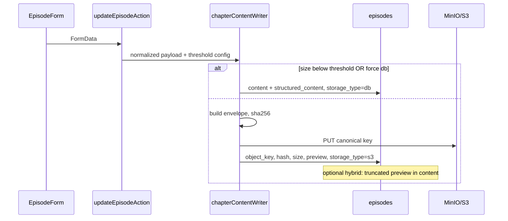
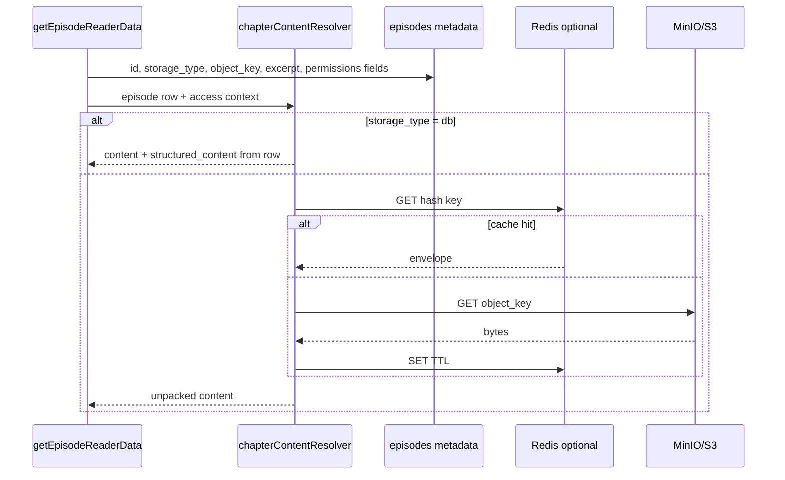

# ChapMee — Chapter content storage plan (hybrid DB + S3)

**Status:** Wired for Studio save/read, reader deferred S3 (paid gate), import + backfill script.  
**Prerequisite:** [STORAGE_ARCHITECTURE_AUDIT.md](./STORAGE_ARCHITECTURE_AUDIT.md)

---

## Implemented (Prompt 2)

| Item | Location |
|------|----------|
| DB columns on `episodes` | `drizzle/0008_episode_content_object_storage.sql` |
| Object key builder | `lib/content/chapter-content-object-key.ts` |
| Serialize / gzip / hash | `lib/content/chapter-content-utils.ts` |
| Plain text extraction | `lib/content/extract-plain-text.ts` |
| Save / load / delete / exists | `lib/storage/chapter-content-storage.ts` |
| S3 byte helpers | `lib/storage/s3.ts` (`putObjectBytes`, `getObjectBytes`) |
| Integration test | `npm run test:chapter-content` |

### Columns on `public.episodes` (chapters)

| Column | Type | Default | Notes |
|--------|------|---------|-------|
| `content_storage_type` | text | `'db'` | `db` \| `s3` \| `hybrid` |
| `content_blob_format` | text | null | `text` \| `markdown` \| `json` \| `composer_json` (S3 logical format; distinct from `content_format`) |
| `content_object_key` | text | null | Stable MinIO/S3 key |
| `content_hash` | text | null | SHA-256 hex of **stored object bytes** (gzip payload when `content_encoding=gzip`) |
| `content_size_bytes` | bigint | null | Byte size of S3 object |
| `content_encoding` | text | null | `identity` \| `gzip` |
| `plain_text_preview` | text | null | Up to 4 000 chars plain text |
| `content_updated_at` | timestamptz | null | Last S3 canonical write |
| `excerpt` | text | (existing) | Set on save — up to 280 chars |
| `word_count` | integer | (existing) | Updated on save from plain text |

Existing `content`, `structured_content`, `content_format` **unchanged** — `content_storage_type='db'` keeps current reader behavior.

### Object key convention

```
story-content/{yyyy}/{mm}/{storyId}/chapters/{chapterId}.{format}.gz
```

Example:

```
story-content/2026/06/550e8400-e29b-41d4-a716-446655440000/chapters/aa11bb22-cc33-4dd5-ee66-778899001122.composer_json.gz
```

Rules: UUIDs only, no titles/domains/localhost, bucket-agnostic (sync MinIO → Vietnix with same keys).

### Save / load API

```typescript
import {
  saveChapterContentObject,
  loadChapterContentObject,
  deleteChapterContentObject,
  chapterContentObjectExists,
  buildChapterContentObjectKey
} from "@/lib/storage/chapter-content-storage";

const saved = await saveChapterContentObject({
  storyId,
  chapterId,
  format: "text", // text | markdown | json | composer_json
  content: "…",
  previousObjectKey: null // optional replace
});
// → { objectKey, hash, sizeBytes, encoding, wordCount, excerpt, plainTextPreview }

const loaded = await loadChapterContentObject({
  objectKey: saved.objectKey,
  format: saved.blobFormat,
  encoding: saved.encoding,
  expectedHash: saved.hash // optional verify
});
```

**Envelope (UTF-8 JSON before gzip):** `{ v: 1, format, text?, structured? }`

**Hash:** SHA-256 of bytes actually stored in S3 (after gzip when `encoding=gzip`).

**Compression:** Default `gzip`; on zlib failure, falls back to `identity` (documented in `encodeChapterContentBytes`).

### Local MinIO

```bash
npm run docker:local:up
npm run db:migrate   # applies drizzle/0008_...
npm run test:chapter-content
```

Uses `S3_*` from `.env.local` (same bucket as media; separate key prefix `story-content/`).

### Production S3 migration

1. Deploy code + run migration on VPS Postgres.
2. `mc mirror` / `aws s3 sync` with **same object keys** (see `scripts/sync-minio-to-s3.sh`).
3. Verify random sample: `content_hash` === SHA-256 of object bytes on prod bucket.
4. Switch `S3_ENDPOINT` / credentials only — no DB key rewrite.

### Rollback

- Set `content_storage_type='db'` on affected rows; reader continues using inline `content`.
- S3 objects can remain; no destructive schema rollback required.

### Operational commands

| Command | Purpose |
|---------|---------|
| `npm run db:migrate` / `db:migrate:status` | Apply / list drizzle `0008`–`0010` |
| `npm run test:chapter-content` | MinIO save/load smoke test |
| `npm run backfill:chapter-content` | Migrate inline `episodes.content` → S3 (`--dry-run`, `--limit=N`, `--story-id=uuid`) |
| `npm run storage:health` | Verify schema + optional S3 probe |

Full runbook: [OPERATIONS_STORAGE.md](./OPERATIONS_STORAGE.md).

**MVP closure:** chapter S3, import, search, cache, integrity scripts, `storage_integrity_runs` (0011), admin `/admin/storage` — no further storage MVP work planned unless product requests ZIP import or automated deletes.

### Wiring status

- [x] `createEpisode` / `updateEpisode` / editor load / publish validation (S3 HEAD)
- [x] Reader: `getEpisodeReaderData` defaults to preview-only; `hydrateEpisodeReaderBody` after paid/early-access gates
- [x] Bulk import drafts + Studio CSV v2 chapter import → `applyEpisodeObjectStorageAfterSave`
- [x] `scripts/backfill-chapter-content-s3.ts`
- [x] Redis cache via `REDIS_URL` (`lib/cache/chapter-content-cache.ts`, fallback memory)

---

## Goals

1. PostgreSQL stores **metadata, permissions, previews, search aids** — not multi‑MB chapter bodies when over threshold.
2. MinIO (local) / Vietnix S3 (prod) stores **canonical full payloads** with stable keys and content hashes.
3. Reader, Studio editor, and import paths use a **single resolver/writer** — no URL or route changes.
4. **Backward compatible:** existing rows keep working with `content_storage_type = 'db'`.
5. Future **MinIO → Vietnix** sync is key-based (copy objects + verify hash), not DB-dependent.

---

## Target schema (additive only)

### `public.episodes` — new columns

```sql
-- Migration sketch (non-destructive; run via db/migrations/legacy or drizzle legacy)
alter table public.episodes
  add column if not exists content_storage_type text not null default 'db',
  add column if not exists content_format_storage text,  -- optional mirror; episodes.content_format stays
  add column if not exists content_object_key text,
  add column if not exists content_hash text,              -- sha256 hex of canonical bytes
  add column if not exists content_size_bytes bigint,
  add column if not exists plain_text_preview text,        -- search/preview; may mirror excerpt
  add column if not exists content_updated_at timestamptz;

comment on column public.episodes.content_storage_type is
  'db | s3 | hybrid — where canonical full body lives';

alter table public.episodes
  add constraint episodes_content_storage_type_check check (
    content_storage_type in ('db', 's3', 'hybrid')
  );

create index if not exists idx_episodes_content_object_key
  on public.episodes (content_object_key)
  where content_object_key is not null;
```

| Column | Purpose |
|--------|---------|
| `content_storage_type` | `db` = legacy inline; `s3` = canonical in object store; `hybrid` = preview in DB + full in S3 |
| `content_format` (existing) | Logical format: `plain_text`, `markdown`, `rich_text`, `structured_json`, `structured_blocks` |
| `content_object_key` | Stable S3 key when `s3` or `hybrid` |
| `content_hash` | Integrity / dedup / migrate verification |
| `content_size_bytes` | Quotas, UI, import validation |
| `plain_text_preview` | First N chars for search cards, paid preview, FTS helper (optional) |
| `excerpt` (existing) | Human-written or import summary — keep |
| `content`, `structured_content` (existing) | **Retained** during migration; may become NULL or truncated when `s3` |

### `public.stories` (standalone) — mirror columns

Same pattern for `standalone_*` fields:

- `standalone_content_storage_type` default `db`
- `standalone_content_object_key`, `standalone_content_hash`, `standalone_content_size_bytes`
- Keep `standalone_plain_text` as preview (already documented for search/SEO)

### Optional: `public.chapter_content_manifest` (phase 2+)

If versioning or multiple blobs per chapter (raw import + published):

```sql
chapter_content_manifest (
  id uuid PK,
  episode_id uuid FK,
  role text,  -- 'canonical' | 'import_raw' | 'export' | 'backup'
  object_key text not null,
  content_format text,
  content_hash text,
  size_bytes bigint,
  created_at timestamptz
)
```

Start without this table; add when import pipeline needs multiple blobs per chapter.

---

## Enumerations

### `content_storage_type`

| Value | Meaning |
|-------|---------|
| `db` | Full body in `content` / `structured_content` (current behavior) |
| `s3` | Canonical bytes only in S3; DB has metadata + preview |
| `hybrid` | Short preview/plain in DB (`plain_text_preview` or truncated `content`) + full payload in S3 |

### `content_format` (existing + mapping to blob)

| Value | S3 `Content-Type` | Blob shape |
|-------|-------------------|------------|
| `plain_text` | `text/plain; charset=utf-8` | Raw UTF-8 text |
| `markdown` | `text/markdown; charset=utf-8` | Raw text |
| `rich_text` | `text/html; charset=utf-8` or JSON | As stored today |
| `structured_json` | `application/json` | Single JSON document |
| `structured_blocks` | `application/json` | Composer document JSON |

**Note:** App type `structured_blocks` maps to storage label `composer_json` in docs/API if needed; DB keeps existing enum for compatibility.

---

## Object key conventions

**Bucket:** `S3_BUCKET` (e.g. `chapmee-local-media` / prod bucket).  
**Never persist** `localhost` or presigned URLs in DB — only keys (see `MEDIA_PLATFORM.md`).

### Canonical chapter content

```
chapter-content/{story_id}/{episode_id}/canonical.{ext}
```

| `content_format` | `ext` | Notes |
|------------------|-------|--------|
| plain_text, markdown, rich_text | `txt` / `md` / `html` | One file |
| structured_json, structured_blocks | `json` | Single JSON file |

**Optional version suffix** (if versioning before overwrite):

```
chapter-content/{story_id}/{episode_id}/v{unix_ms}.json
```

Prefer **overwrite canonical** + bump `content_hash` for simplicity unless audit trail required.

### Standalone story

```
story-content/{story_id}/standalone/canonical.json
```

### Import / staging (see IMPORT_PIPELINE_PLAN.md)

```
import-raw/{job_id}/{source_filename}
import-staging/{job_id}/{story_external_key}/{chapter_order}.json
```

### Backups / export

```
export/{owner_id}/{job_id}/stories.zip
export/{owner_id}/{job_id}/chapters.csv
```

**Alignment with media keys:** existing folders (`chapter-media/`, `story-covers/`) unchanged; `chapter-content/` is **text/json only**.

---

## Canonical blob envelope (recommended)

For formats that today split `content` + `structured_content`, store **one JSON envelope** in S3:

```json
{
  "v": 1,
  "content_format": "structured_blocks",
  "presentation_mode": "standard_prose",
  "content": "plain fallback for reader",
  "structured_content": { }
}
```

Benefits: single hash, single GET, matches import/export; reader resolver unpacks to current `EpisodeReaderData` shape.

---

## Save flow (editor / server actions)



### Implementation targets (new modules)

| Module | Responsibility |
|--------|----------------|
| `lib/content/chapter-content-writer.ts` | Threshold check, PUT S3, DB patch |
| `lib/content/chapter-content-resolver.ts` | Read path (below) |
| `lib/content/chapter-content-envelope.ts` | Serialize/deserialize canonical JSON |
| `lib/content/thresholds.ts` | `CHAPTER_CONTENT_S3_THRESHOLD_BYTES` env (e.g. 32_768) |

**Wire into existing actions (later prompts):**

- `lib/creator/createEpisode.ts`
- `lib/creator/updateEpisode.ts`
- `lib/creator/persist-standalone-story-content.ts`
- `lib/studio/save-draft.ts` (drafts may stay DB-only until phase 5)
- `lib/studio/import-export-v2-server.ts` (after import pipeline phase)

### Write rules

1. Compute `size_bytes` and `content_hash` from canonical bytes (UTF-8).
2. On S3 PUT failure: **do not** clear DB copy; return error to user.
3. On success with `storage_type=s3`: update metadata; optionally clear large `structured_content` in DB **only after** verified HEAD object (phase 5).
4. Update `content_updated_at` on every successful publish.

---

## Read flow (reader resolver)



### Access control order

1. PostgREST/RLS: user can see episode row (status, visibility).
2. `getPaidChapterReaderState` / early access: **must run before** returning full body from S3.
3. If locked: return only `plain_text_preview` / monetization slice — **never** fetch full S3 object for unpaid users.

### Implementation targets

- Refactor `lib/episodes/getEpisodeReaderData.ts` to call resolver (keep exported types stable).
- `lib/monetization/paid-chapters.ts`: accept preview string from DB or resolver helper — avoid loading full S3 blob when locked.

---

## Cache flow (Redis — future)

| Key | Value | TTL |
|-----|-------|-----|
| `chapter:{episode_id}:v{content_hash}` | Serialized envelope or plain text | 15–60 min hot |
| `story:{story_id}:meta` | Optional story detail cache | separate concern |

**Local:** `REDIS_URL=redis://127.0.0.1:6379` (container exists; wire in phase 4).  
**Invalidation:** on chapter save, `DEL` keys for `episode_id`; use hash in key to auto-invalidate on content change.

---

## Migration strategy

### Threshold policy

| Condition | Action |
|-----------|--------|
| `word_count < 500` AND bytes < 32KB | Keep `db` unless creator opts in |
| bytes ≥ 32KB OR structured_content > 16KB | New writes → `s3` |
| Existing large rows | Backfill script |

### Backfill script (batch)

`scripts/backfill-chapter-content-s3.ts` (to implement):

1. Select episodes where `content_storage_type = 'db'` and `length(content) + pg_column_size(structured_content) > threshold`.
2. Build envelope → PUT S3 → update metadata.
3. Verify `content_hash` via HEAD.
4. Log failures; **do not** delete DB columns in pass 1.

### Rollback

- Set `content_storage_type = 'db'` and retain original columns until pass 5 cleanup.
- S3 objects can remain orphaned; cleanup job uses `content_object_key` + episode existence.

---

## Backward compatibility

| Scenario | Behavior |
|----------|----------|
| Old rows, no new columns | Default `db`; resolver reads `content` |
| New columns NULL | Treat as `db` |
| Export CSV v2 | Exporter reads via resolver (full text for download) |
| PostgREST direct clients | Still see metadata columns; large `content` may be null after phase 5 — **service role** export uses resolver |
| Composer media_ids | Unchanged; still in structured JSON inside envelope |

---

## Dual-write period (recommended)

**Weeks 1–2 after phase 2:**

- Write S3 **and** DB for all new/updated chapters over threshold.
- Reader prefers S3 when `storage_type` in (`s3`,`hybrid`) and hash matches.
- Compare hash DB vs S3 in shadow mode (log mismatch).

**After stable:**

- Stop dual-write to `content` for `s3` rows.
- Keep `excerpt`, `plain_text_preview`, `word_count`, `content_hash`.

---

## Environment variables

| Variable | Purpose |
|----------|---------|
| `S3_ENDPOINT`, `S3_BUCKET`, `S3_ACCESS_KEY_ID`, `S3_SECRET_ACCESS_KEY` | Existing |
| `S3_PUBLIC_BASE_URL` | Images only; chapter blobs use server-side GET |
| `CHAPTER_CONTENT_S3_THRESHOLD_BYTES` | Default 32768 |
| `CHAPTER_CONTENT_CACHE_TTL_SECONDS` | Redis TTL |
| `REDIS_URL` | Optional cache |

---

## Validation checklist (per phase)

### Phase 1 — schema

- [ ] Migration applies on local `npm run db:legacy`
- [ ] Existing episodes unchanged (default `db`)
- [ ] PostgREST exposes new columns with RLS unchanged

### Phase 2 — writer/resolver

- [ ] Create chapter < threshold → still `db`
- [ ] Create chapter > threshold → S3 object exists, DB has key + hash
- [ ] Reader renders identical HTML for db vs s3 row
- [ ] Paid chapter locked → no full S3 fetch
- [ ] Composer publish validation unchanged

### Phase 3 — backfill

- [ ] Sample 100 large chapters: hash match
- [ ] Rollback flag restores DB read

### Phase 4 — import

- [ ] CSV import uses writer (see IMPORT_PIPELINE_PLAN.md)

### Phase 5 — DB slimming

- [ ] pg_dump size reduced
- [ ] No regression in search (excerpt/preview still populated)

---

## Files to touch (future implementation — ordered)

1. `db/migrations/legacy/XXX_chapter_content_storage.sql`
2. `lib/content/chapter-content-*.ts` (new)
3. `lib/episodes/getEpisodeReaderData.ts`
4. `lib/creator/createEpisode.ts`, `updateEpisode.ts`
5. `lib/creator/persist-standalone-story-content.ts`
6. `lib/monetization/paid-chapters.ts`
7. `lib/studio/import-export-v2-server.ts`
8. `scripts/backfill-chapter-content-s3.ts`
9. `.env.example` — new env vars

**Out of scope:** UI components, routes, Supabase SDK.

---

## Sync MinIO → Vietnix S3

1. **Inventory:** `SELECT content_object_key, content_hash FROM episodes WHERE content_storage_type IN ('s3','hybrid')`.
2. **Copy:** `mc mirror` / `aws s3 sync` preserving keys.
3. **Verify:** HEAD `ETag` or sha256 match `content_hash`.
4. **Cutover:** Update `S3_ENDPOINT`, credentials, bucket; **no** DB key changes if key layout identical.
5. **Rollback:** Point env back; objects unchanged on source.

---

## Related

- [STORAGE_ARCHITECTURE_AUDIT.md](./STORAGE_ARCHITECTURE_AUDIT.md)
- [IMPORT_PIPELINE_PLAN.md](./IMPORT_PIPELINE_PLAN.md)
