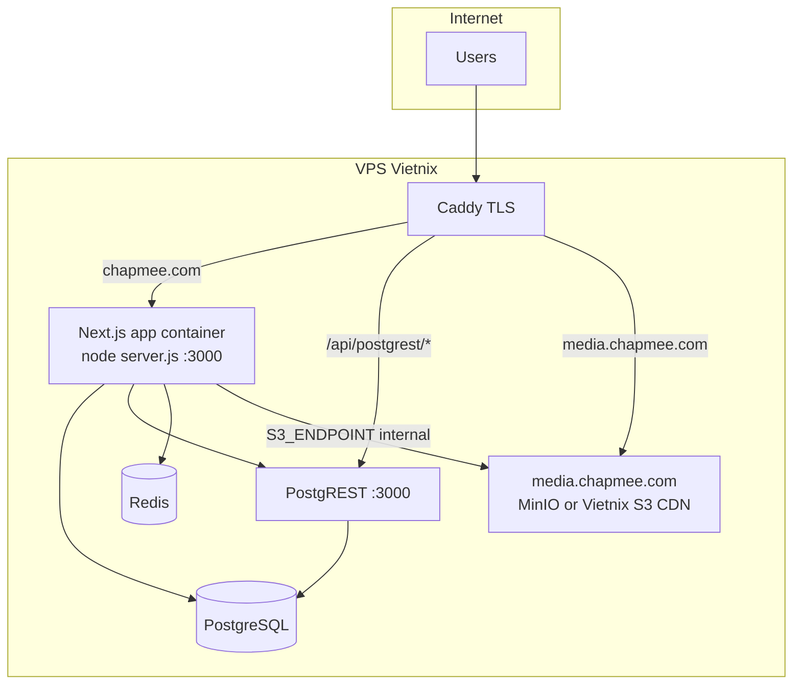

# ChapMee — Deploy Vietnix infrastructure audit

**Date:** 2026-06-03  
**Scope:** Read-only audit before production deploy pack. No app rewrite, no `pnpm build`, no secrets committed.

**Related docs (already in repo):** `DEPLOY_VIETNIX.md`, `.env.production.example`, `docs/PRODUCTION_ENV_GUIDE.md`, `docs/PRODUCTION_ENV_AUDIT_REPORT.md`, `INFRA_MIGRATION.md`, `LOCAL_SETUP.md`, `LOCAL_MEDIA_MIGRATION.md`, `MEDIA_PLATFORM.md`.

---

## Executive summary

| Area | Finding |
|------|---------|
| Package manager | **pnpm** preferred (`pnpm-lock.yaml` + Dockerfile); scripts/docs also use **npm**; `package-lock.json` present (dual lockfiles). |
| Production app process | Docker: `node server.js` (Next **standalone**). Bare metal: `npm run start` → `next start`. |
| DB | **PostgreSQL** + **Drizzle ORM** (Better Auth, new features) + **~197 legacy SQL** + **29 drizzle/*.sql** foundation migrations. |
| Data access (runtime) | **PostgREST compatibility layer is still required** — hundreds of server/client paths use `createDatabaseClient` / browser PostgREST, not Drizzle pool alone. |
| Object storage | **AWS SDK v3** via `lib/storage/s3.ts`; canonical env prefix **`S3_*`** + public **`NEXT_PUBLIC_S3_PUBLIC_BASE_URL`**. |
| Media DB | **`storage_assets`** table; **`media_assets`** is a **VIEW** (not a separate table). Entities store `*_media_asset_id` / object keys. |
| Existing deploy artifacts | `Dockerfile`, `docker-compose.yml`, `docker-compose.local.yml`, `DEPLOY_VIETNIX.md`, `scripts/backup-db.sh`, `scripts/backup-local-db.sh`, `scripts/validate-env.ts`, `scripts/verify-local.mjs`, `scripts/storage-health.ts`. |
| Critical gaps | No **Caddyfile** in repo; no **MinIO** in prod compose (conflicts with `.env.production.example`); **hardcoded `PGRST_JWT_SECRET`** in `docker-compose.yml`; no **`/api/health`**; no **`.dockerignore`**; no **`docker-compose.prod.yml`**; no dedicated **DB restore** script. |

---

## 1. Package manager and scripts

### 1.1 Package manager

| Signal | Value |
|--------|--------|
| `pnpm-lock.yaml` | Present — Dockerfile installs with `pnpm install --frozen-lockfile` when this file exists |
| `package-lock.json` | Present — fallback `npm ci` in Dockerfile |
| `package.json` `"packageManager"` | **Not set** |
| Local docs | `LOCAL_SETUP.md` uses `npm install --legacy-peer-deps` |
| `db:setup` / seed scripts | Invoke **`npm run`** subcommands |

**Recommendation for production build:** standardize on **pnpm** (matches Dockerfile) or document npm-only and drop one lockfile in a later cleanup PR.

### 1.2 `package.json` scripts (audit target)

| Script | Command | Role |
|--------|---------|------|
| `dev` | `next dev --webpack` | Local development |
| `build` | `next build --webpack` | Production build (standalone output) |
| `start` | `next start` | Production without Docker (port 3000 default) |
| `db:migrate` | `node scripts/db-migrate-foundation.mjs` | Apply ordered `drizzle/*.sql` |
| `db:migrate:status` | same + `--status` | Migration status |
| `db:push` | `drizzle-kit push` | Dev schema push (not primary prod path) |
| `db:seed` | `npx tsx scripts/db-seed-local.ts` | Local demo seed |
| `db:legacy` | `node scripts/db-apply-legacy-migrations.mjs` | ~197 files under `db/migrations/legacy/` |
| `db:shims` | `node scripts/db-apply-shims.mjs` | Idempotent SQL shims |
| `db:setup` | `db:migrate && db:legacy && db:shims` | Full fresh DB setup |
| `lint` | `eslint .` | Lint |
| `typecheck` | `tsc --noEmit` | Type check |
| `test` | **No generic `test` script** | Use `test:rbac`, `test:seo`, `test:topup`, etc. |
| `env:validate` | `tsx scripts/validate-env.ts` | Env template checker |

Other deploy-relevant scripts: `docker:local:up`, `verify:local`, `storage:health`, `storage:check-all`, `media:check`, `email:worker`.

### 1.3 Production start command

| Context | Command |
|---------|---------|
| **Docker (current `Dockerfile`)** | `CMD ["node", "server.js"]` — requires `output: "standalone"` in `next.config.ts` (configured) |
| **npm** | `npm run start` → `next start` |
| **Not used in Docker** | `next start` directly |

Migrations inside running app container (from `DEPLOY_VIETNIX.md`):

```bash
docker compose exec app node scripts/db-migrate-foundation.mjs
docker compose exec app node scripts/db-apply-legacy-migrations.mjs
# Recommended on fresh DB — also:
docker compose exec app node scripts/db-apply-shims.mjs
```

Equivalent npm aliases: `npm run db:migrate`, `npm run db:legacy`, `npm run db:shims`, or `npm run db:setup` for all three.

---

## 2. Environment variable matrix

Canonical reference: `scripts/validate-env.ts` (`--production`), `.env.example`, `.env.production.example`, `docs/PRODUCTION_ENV_GUIDE.md`.

### 2.1 Required server env (production runtime)

| Variable | Used in (primary) | Notes |
|----------|-------------------|--------|
| `DATABASE_URL` | `lib/db/pool.ts`, migration scripts | Docker: `postgresql://chapmee:…@postgres:5432/chapmee` |
| `BETTER_AUTH_SECRET` | `lib/auth/auth.ts` | Required; no fallback in prod |
| `BETTER_AUTH_URL` | `lib/auth/auth.ts` | Falls back to `APP_URL` / `NEXT_PUBLIC_APP_URL` |
| `APP_URL` | `lib/auth/auth.ts` | Recommended; not in current `.env.local` keys list |
| `POSTGREST_URL` | `lib/db/postgrest/*`, `lib/data/env.ts` | Internal: `http://postgrest:3000` |
| `POSTGREST_JWT_SECRET` | `lib/auth/postgrest-jwt.ts` | Must match PostgREST `PGRST_JWT_SECRET` |
| `S3_ENDPOINT` | `lib/storage/s3.ts` | **Required** (throws if missing) |
| `S3_ACCESS_KEY_ID` | `lib/storage/s3.ts` | **Required** |
| `S3_SECRET_ACCESS_KEY` | `lib/storage/s3.ts` | **Required** |
| `S3_BUCKET` | `lib/storage/s3.ts` | **Required** |
| `S3_PUBLIC_BASE_URL` | `lib/storage/s3.ts`, `lib/media/*` | Public URL builder (path-style includes bucket) |
| `S3_REGION` | `lib/storage/s3.ts` | Default `us-east-1` if unset |
| `S3_FORCE_PATH_STYLE` | `lib/storage/s3.ts` | Default **true** unless value is `"false"` |
| `REDIS_URL` | `lib/cache/cache.ts`, chapter cache | Optional for app boot; chapter cache degrades to memory |

### 2.2 Required public env (`NEXT_PUBLIC_*`)

| Variable | Used in | Notes |
|----------|---------|--------|
| `NEXT_PUBLIC_APP_URL` | `lib/auth/browser-auth.ts`, UI | Must be `https://chapmee.com` in prod |
| `NEXT_PUBLIC_SITE_URL` | `lib/site/site-url.ts`, SEO, feeds | Should match app URL |
| `NEXT_PUBLIC_POSTGREST_URL` | `lib/db/browser-client.ts` | Browser must reach HTTPS proxy (see §6) |
| `NEXT_PUBLIC_S3_PUBLIC_BASE_URL` | `lib/media/public-media-client.ts` | Client media preview; mirror `S3_PUBLIC_BASE_URL` |

Also used: `NEXT_PUBLIC_APP_NAME` (`lib/brand/constants.ts`).

### 2.3 Strongly recommended (not always validated as errors)

| Variable | Usage |
|----------|--------|
| `POSTGRES_PASSWORD` | `docker-compose.yml` postgres + postgrest URI |
| `CRON_SECRET` | All `app/api/cron/*` routes |
| `ENCRYPTION_KEY` | `lib/security/encryption.ts` — payment/provider secrets at rest |
| `CHAPTER_CONTENT_CACHE_TTL_MS` | Default 900000 ms if unset |
| `EMAIL_MODE`, `SMTP_*`, `MAIL_*` | `lib/email/email-config.ts` — prod template uses `smtp` |

### 2.4 Optional / feature flags

| Variable | Usage |
|----------|--------|
| `CHAPMEE_POSTGREST_TIMEOUT_MS` | `lib/data/client-options.ts` (legacy alias `CHAPCHAP_POSTGREST_TIMEOUT_MS`) |
| `CHAPMEE_SKIP_REMOTE_CONFIG` | `lib/config/product-config.ts` |
| `CHAPMEE_DISABLE_SNIPPETS` | `lib/snippets/settings.ts` |
| `CHAPMEE_POSTGREST_URL` | Alias for `POSTGREST_URL` |
| `POSTGREST_SERVICE_ROLE` / `PGREST_SERVICE_ROLE` | Static JWT override |
| `NEXT_PUBLIC_MEDIA_BASE_URL` | **Legacy alias** in `lib/media/public-media-client.ts` — prefer `NEXT_PUBLIC_S3_PUBLIC_BASE_URL` |
| `NEXT_PUBLIC_TURNSTILE_SITE_KEY`, `TURNSTILE_SECRET_KEY` | Crawl challenge |
| `SEPAY_*` | Payments |
| `CHAPMEE_FACEBOOK_URL`, `CHAPMEE_TIKTOK_URL`, `CHAPMEE_YOUTUBE_URL` | `lib/chapmee-social-links.ts` |
| `PG_POOL_MAX`, `PG_CONNECT_TIMEOUT_MS` | `lib/db/pool.ts` |
| `FEED_MIXER_DISABLED`, `NEXT_PUBLIC_FEED_DEBUG`, etc. | Feature toggles |

### 2.5 Legacy env (do not use for new deploy)

| Item | Status |
|------|--------|
| `CHAPCHAP_*` | Aliases via `lib/env/legacy-env.ts` — prefer `CHAPMEE_*` |
| `NEXT_PUBLIC_SUPABASE_*`, `SUPABASE_SERVICE_ROLE_KEY` | **Removed** from runtime |
| `PGRST_JWT_SECRET` | Read as fallback in `postgrest-jwt.ts` / `verify-local.mjs` — **compose should use `POSTGREST_JWT_SECRET` env substitution** |

### 2.6 `.env.local` vs code (keys only — no values)

**Keys present in workspace `.env.local` (audit):**  
`APP_URL`, `BETTER_AUTH_*`, `CHAPMEE_POSTGREST_TIMEOUT_MS`, `CHAPMEE_SKIP_REMOTE_CONFIG`, `DATABASE_URL`, `ENCRYPTION_KEY`, `NEXT_PUBLIC_APP_*`, `NEXT_PUBLIC_POSTGREST_URL`, `NEXT_PUBLIC_SITE_URL`, `POSTGREST_*`, `RBAC_TEST_PASSWORD`, `REDIS_URL`, `S3_*` (full set except public client mirror).

| Gap | Detail |
|-----|--------|
| In `.env.local`, **not** in code as required | — |
| In **code / `.env.example`**, **missing from `.env.local`** | `NEXT_PUBLIC_S3_PUBLIC_BASE_URL` — client falls back to `NEXT_PUBLIC_MEDIA_BASE_URL` then undefined |
| In **`.env.example`**, optional, absent locally | `EMAIL_*`, `CRON_SECRET`, `CHAPTER_CONTENT_CACHE_TTL_MS`, `SEED_DEMO_PASSWORD`, social URLs |
| In **production template only** | `POSTGRES_PASSWORD`, `CRON_SECRET` |

**Note:** User brief mentioned `NEXT_PUBLIC_MEDIA_BASE_URL`; codebase standard is **`NEXT_PUBLIC_S3_PUBLIC_BASE_URL`** with `NEXT_PUBLIC_MEDIA_BASE_URL` as secondary fallback only.

---

## 3. Database / ORM / migrations

### 3.1 Stack

| Layer | Technology |
|-------|------------|
| Database | PostgreSQL 17 (Docker images in compose files) |
| ORM (new code + Better Auth) | **Drizzle** (`drizzle-orm`, `lib/db/index.ts`, `lib/db/schema/*`) |
| Legacy query API | **PostgREST HTTP client** (`lib/db/postgrest/*`, `lib/data/server.ts`) |
| Raw SQL | `pg` pool (`lib/db/pool.ts`), migration scripts |
| Kysely | Listed in `package.json` — **no TypeScript imports found** (unused dependency) |
| Prisma | **Not used** |

### 3.2 Migration layout

| Path | Count | Tooling |
|------|-------|---------|
| `drizzle/*.sql` | 29 files (`0000`–`0028`) | `npm run db:migrate` → `scripts/db-migrate-foundation.mjs` |
| `db/migrations/legacy/*.sql` | **197** files | `npm run db:legacy` |
| Shims | `scripts/db-apply-shims.mjs` | `npm run db:shims` |
| Drizzle Kit | `drizzle.config.ts` | `db:generate`, `db:push`, `db:studio` — dev/maintenance |

Tracking table: `public.schema_migrations` (foundation + legacy prefixed entries).

### 3.3 Production migration command (authoritative)

**Fresh production database:**

```bash
# Inside app container or host with DATABASE_URL set:
node scripts/db-migrate-foundation.mjs
node scripts/db-apply-legacy-migrations.mjs
node scripts/db-apply-shims.mjs
```

**Existing DB migrated from Supabase (legacy already applied):**

```bash
npm run db:legacy:stamp   # one-time
npm run db:migrate        # apply new drizzle only
```

**Status checks:** `npm run db:migrate:status`, `npm run db:legacy:status`.

### 3.4 Seed / dev data

| Script | Purpose |
|--------|---------|
| `npm run db:seed` | `scripts/db-seed-local.ts` — demo users + content (not for production) |
| `npm run db:seed:rbac` | Seed with RBAC test users |
| `db/seed.sql` | Referenced by seed script / docs |

Requires `DATABASE_URL`, `BETTER_AUTH_SECRET`; optional `SEED_DEMO_PASSWORD` / `RBAC_TEST_PASSWORD`.

### 3.5 Media schema

- Canonical table: **`public.storage_assets`** (created in legacy migrations / drizzle shims).
- **`public.media_assets`**: **VIEW** over `storage_assets` (see `drizzle/0000_foundation.sql`, `0004_drop_foundation_media_assets_table.sql`).
- FK columns: e.g. `stories.cover_media_asset_id`, `profiles.avatar_media_id`, SEO `og_image_asset_id` (`drizzle/0006`, `0007`, `0023`, `0025`).
- Chapter **text** bodies: S3 keys on `episodes` (`content_object_key`, etc.) — **not** `media_assets` (`drizzle/0008`).

---

## 4. Storage / media

### 4.1 S3 env names (exact — as implemented)

| Purpose | Variable |
|---------|----------|
| SDK endpoint (upload/presign/server) | `S3_ENDPOINT` |
| Region | `S3_REGION` |
| Bucket | `S3_BUCKET` |
| Credentials | `S3_ACCESS_KEY_ID`, `S3_SECRET_ACCESS_KEY` |
| Path-style vs virtual-host | `S3_FORCE_PATH_STYLE` |
| Server-built public URLs | `S3_PUBLIC_BASE_URL` |
| Browser client preview | `NEXT_PUBLIC_S3_PUBLIC_BASE_URL` |
| Legacy client alias | `NEXT_PUBLIC_MEDIA_BASE_URL` |

**Not used in code:** `NEXT_PUBLIC_MEDIA_BASE_URL` as primary name in `.env.example` (only fallback). User brief’s `media.chapmee.com` is a **DNS/CDN** concern mapped into `S3_PUBLIC_BASE_URL` / `NEXT_PUBLIC_S3_PUBLIC_BASE_URL`, not a separate `MEDIA_*` SDK variable.

### 4.2 Upload pipeline

1. `POST /api/media/presign-upload` — auth, `createPresignedUploadUrl`, `createPendingMediaAsset` (`lib/storage/media`).
2. Client uploads to presigned URL.
3. `POST /api/media/complete-upload` — finalize asset row.
4. Chapter/story images also have dedicated routes (e.g. `app/api/chapter-images/upload`).

Object keys generated via `lib/storage/media-paths.ts`; display via `lib/media/media-resolver.ts`, `lib/media/media-url.ts` → `getPublicMediaUrl()` / `S3_PUBLIC_BASE_URL`.

### 4.3 Hard-coded localhost / MinIO URLs

| Location | Risk |
|----------|------|
| Dev fallbacks | `lib/db/browser-client.ts`, `lib/data/env.ts`, `lib/auth/auth.ts` — `127.0.0.1:54321`, `localhost:3000` when env unset |
| `next.config.ts` `images.remotePatterns` | Allows `localhost:9000` / `127.0.0.1:9000` for dev; production should add `media.chapmee.com` |
| Guards | `containsForbiddenLocalMediaUrl` in media resolver; `scripts/audit-media-storage-refs.ts` |
| Seed script | Console URLs to `localhost:3000` only in logs |

**Policy:** DB stores `media_asset_id` / object keys; public URLs built at read time from env.

### 4.4 Bucket init scripts

| Environment | Mechanism |
|-------------|-----------|
| **Local** | `docker-compose.local.yml` service **`minio-init`** (`mc mb`, anonymous download on `chapmee-local-media`) |
| **Production compose** | **No MinIO / no init job** in `docker-compose.yml` |
| **Docs** | `DEPLOY_VIETNIX.md` says production uses **Vietnix S3**, not MinIO — conflicts with `.env.production.example` using `http://minio:9000` |

---

## 5. PostgREST status

### 5.1 Evidence of active use

- Server: `createDatabaseClient()` from `lib/data/server.ts` — imported across **large** admin/studio/data surface (hundreds of modules).
- Browser: `createClient()` → `createBrowserDatabaseClient()` (`lib/data/client.ts`, `lib/db/browser-client.ts`) — login, messages, coin balance, studio, etc.
- JWT: `lib/auth/postgrest-jwt.ts`, `lib/auth/postgrest-headers.ts` — session RLS.
- Drizzle pool: used for Better Auth, newer modules, scripts — **not** a full replacement for PostgREST reads/writes yet.
- Dedicated drizzle migration: `drizzle/0005_postgrest_role_grants.sql`, `0027_postgrest_service_role_table_grants.sql`.

### 5.2 Conclusion

| Question | Answer |
|----------|--------|
| Need PostgREST service in production? | **Yes — mandatory for current codebase** |
| Docker service required? | **Yes** — `postgrest` in `docker-compose.yml` (and local compose) |
| Browser exposure | `NEXT_PUBLIC_POSTGREST_URL` must be **public HTTPS**; **no** Next.js `/api/postgrest` route — **Caddy (or nginx) reverse proxy required** (`docs/PRODUCTION_ENV_GUIDE.md` §F) |
| PostgREST not published to host in prod compose | Only `expose: 3000` — Caddy must join Docker network or publish `127.0.0.1:54321` |

### 5.3 TODO (legacy cleanup — later)

- [ ] Migrate high-traffic reads/writes from PostgREST client to Drizzle/API routes.
- [ ] Remove `NEXT_PUBLIC_POSTGREST_URL` from browser once client code uses same-origin API only.
- [ ] Drop `postgrest` container when RLS-compatible server paths cover all features.

---

## 6. Existing deploy files

| File | Status | Notes |
|------|--------|--------|
| `Dockerfile` | **Exists** | Multi-stage, pnpm/npm, standalone `server.js` |
| `docker-compose.yml` | **Exists** | `app`, `postgres`, `redis`, `postgrest` — **no MinIO** |
| `docker-compose.local.yml` | **Exists** | postgres, redis, minio, minio-init, postgrest |
| `docker-compose.prod.yml` | **Missing** | — |
| `Caddyfile` | **Missing** (sample only in `DEPLOY_VIETNIX.md`) | Need `media.chapmee.com` + `/api/postgrest` proxy |
| nginx config | **Missing** | — |
| `.dockerignore` | **Missing** | Build context not optimized |
| `DEPLOY_VIETNIX.md` | **Exists** (untracked in git status) | Operator runbook |
| `scripts/backup-db.sh` | **Exists** | Prod `pg_dump` via Docker exec |
| `scripts/backup-local-db.sh` | **Exists** | Local plain SQL dump |
| DB restore script | **Missing** | Restore hint only in backup-local comment |
| HTTP health endpoint | **Missing** | No `app/api/health`; use `scripts/verify-local.mjs` / `storage:health` offline |
| `scripts/validate-env.ts` | **Exists** | `npm run env:validate` |
| `scripts/storage-health.ts` | **Exists** | `npm run storage:health` |
| `INFRA_MIGRATION.md` | **Exists** | Migration status checklist |

### 6.1 `docker-compose.yml` production issues (must fix in deploy prompt)

1. **`PGRST_JWT_SECRET` hardcoded** in `postgrest.environment` — must be `${POSTGREST_JWT_SECRET}` from `.env.production` (security + drift vs app).
2. **No `minio` service** while `.env.production.example` sets `S3_ENDPOINT=http://minio:9000` — choose **Vietnix S3** (external endpoint) **or** add MinIO + Caddy on `media.chapmee.com`.
3. **PostgREST** not mapped to host port for Caddy — document network attachment or `ports: "127.0.0.1:54321:3000"`.
4. **`app` depends_on postgrest** — correct for startup order; ensure JWT + DB roles migrated before traffic.

---

## 7. Missing deploy files (for next prompt)

| Priority | File / artifact |
|----------|-----------------|
| P0 | Production `docker-compose` alignment (MinIO **or** Vietnix S3, JWT from env, optional `minio-init`) |
| P0 | **Caddyfile** (repo or `deploy/`) — `chapmee.com`, `www`, `media.chapmee.com`, `/api/postgrest/*` |
| P0 | Fix `PGRST_JWT_SECRET` substitution in compose |
| P1 | `.dockerignore` |
| P1 | `GET /api/health` (or `/api/healthz`) for Caddy/Docker healthcheck |
| P1 | `docker-compose.prod.yml` or documented single compose overlay |
| P2 | `scripts/restore-db.sh` |
| P2 | Production MinIO bucket init (if self-hosted MinIO on VPS) |
| P2 | Cron unit files / docs for `app/api/cron/*` with `CRON_SECRET` |
| P2 | Resolve dual lockfile policy (`pnpm` vs `npm`) |

---

## 8. Recommended production architecture



| Component | Role |
|-----------|------|
| **Caddy** | TLS, reverse proxy app, proxy PostgREST for browser, public media domain |
| **Next.js** | App, Better Auth, presign APIs, cron routes, standalone |
| **PostgreSQL** | Primary data |
| **Redis** | Chapter content cache (optional but configured in prod template) |
| **PostgREST** | Legacy RLS SQL API — **required today** |
| **S3-compatible storage** | Vietnix S3 **or** MinIO on VPS; `S3_ENDPOINT` internal, `S3_PUBLIC_BASE_URL` = `https://media.chapmee.com/{bucket}` |

---

## 9. Implementation order (next prompts)

1. **Decide storage topology:** Vietnix S3 only vs MinIO on VPS — align `docker-compose.yml` and `.env.production.example` (today they disagree with `DEPLOY_VIETNIX.md`).
2. **Fix compose secrets wiring** — `POSTGREST_JWT_SECRET`, `POSTGRES_PASSWORD`, add MinIO services if needed.
3. **Add Caddyfile** to repo + document reload; wire `NEXT_PUBLIC_POSTGREST_URL=https://chapmee.com/api/postgrest`.
4. **Add `.dockerignore` + health route**; wire Docker `healthcheck` on `app` and `postgres`.
5. **Document one-shot prod bootstrap:** `db:setup` (or migrate + legacy + shims), env validate, `verify-local` equivalent for prod.
6. **Backup/restore** — cron for `scripts/backup-db.sh`, optional rclone to S3.
7. **Post-deploy validation** — auth, presign upload, public media URL on `media.chapmee.com`, PostgREST from browser, cron with `CRON_SECRET`.
8. **Long-term:** PostgREST deprecation plan (Drizzle/API migration).

---

## 10. Risks

| Risk | Severity | Mitigation |
|------|----------|------------|
| PostgREST unreachable from browser | **High** | Caddy proxy + correct `NEXT_PUBLIC_POSTGREST_URL` |
| JWT mismatch app ↔ PostgREST | **High** | Single secret via env; remove hardcoded compose value |
| S3 endpoint / public URL mismatch | **High** | Path-style base includes bucket; test presign + `` |
| Fresh DB without `db:legacy` | **High** | Run full `db:setup` once |
| Dual lockfiles (pnpm/npm) | Medium | Pick one CI/install path |
| No HTTP healthcheck | Medium | Add `/api/health` for orchestration |
| `ENCRYPTION_KEY` / `CRON_SECRET` empty | Medium | Set before payments / cron |
| Realtime messages stub | Low | Document limitation (`INFRA_MIGRATION.md`) |
| `DEPLOY_VIETNIX.md` vs compose MinIO | Medium | Resolve in deploy pack |

---

## 11. Files inspected

| Category | Paths |
|----------|--------|
| Package | `package.json`, `pnpm-lock.yaml`, `package-lock.json` |
| Env | `.env.example`, `.env.production.example`, `.env.local` (keys only) |
| Docker | `Dockerfile`, `docker-compose.yml`, `docker-compose.local.yml` |
| Next | `next.config.ts` |
| DB | `drizzle.config.ts`, `drizzle/*.sql` (29), `db/migrations/legacy/` (197), `scripts/db-migrate-foundation.mjs`, `scripts/db-apply-legacy-migrations.mjs` |
| ORM / auth | `lib/db/index.ts`, `lib/db/pool.ts`, `lib/auth/auth.ts` |
| PostgREST | `lib/db/postgrest/*`, `lib/data/server.ts`, `lib/data/client.ts`, `lib/db/browser-client.ts` |
| S3 / media | `lib/storage/s3.ts`, `lib/media/media-resolver.ts`, `lib/media/public-media-client.ts`, `app/api/media/presign-upload/route.ts` |
| Ops | `scripts/validate-env.ts`, `scripts/verify-local.mjs`, `scripts/backup-db.sh`, `scripts/backup-local-db.sh`, `scripts/storage-health.ts` |
| Docs | `DEPLOY_VIETNIX.md`, `INFRA_MIGRATION.md`, `LOCAL_SETUP.md`, `docs/PRODUCTION_ENV_GUIDE.md`, `docs/PRODUCTION_ENV_AUDIT_REPORT.md` |

---

## 12. Validation performed (this task)

- [x] `git status` (deploy-related paths)
- [x] Package / env / ORM / media / deploy file audit
- [x] Created `docs/DEPLOY_VIETNIX_AUDIT_REPORT.md`
- [x] Did **not** run `pnpm build`
- [x] Did **not** modify `.env.local` or commit secrets

---

## 13. Answers to acceptance criteria

| Criterion | Result |
|-----------|--------|
| Report exists | `docs/DEPLOY_VIETNIX_AUDIT_REPORT.md` |
| Exact S3 env names | **`S3_ENDPOINT`, `S3_REGION`, `S3_BUCKET`, `S3_ACCESS_KEY_ID`, `S3_SECRET_ACCESS_KEY`, `S3_FORCE_PATH_STYLE`, `S3_PUBLIC_BASE_URL`, `NEXT_PUBLIC_S3_PUBLIC_BASE_URL`** (+ legacy `NEXT_PUBLIC_MEDIA_BASE_URL`) |
| PostgREST required? | **Yes** — Docker `postgrest` service + public HTTPS proxy |
| Production migration command | `node scripts/db-migrate-foundation.mjs` then `node scripts/db-apply-legacy-migrations.mjs` (+ `db-apply-shims.mjs` on fresh DB) |
| Files to create next | See §7 |
