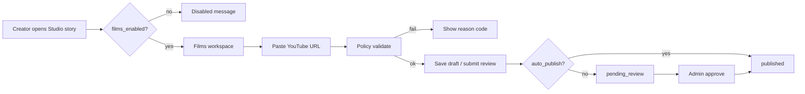
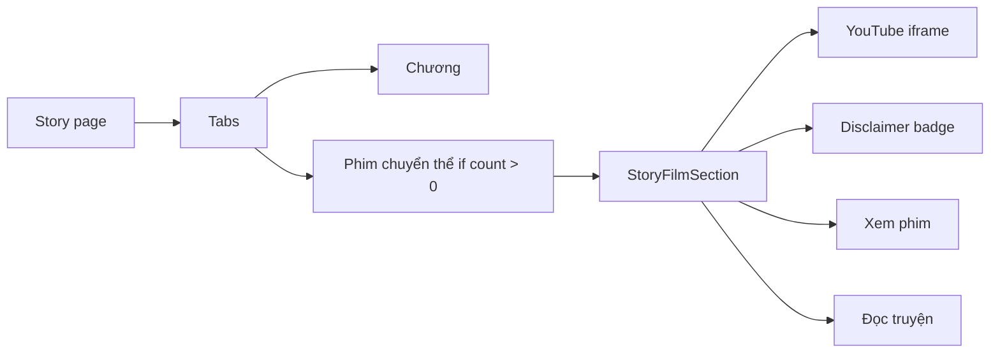
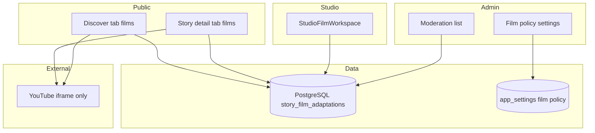

# Phim chuyển thể — Kiến trúc & Audit hiện trạng

**Trạng thái:** Thiết kế (PROMPT 1 — audit + docs only)  
**Ngày:** 2026-06-02  
**Phạm vi:** Phim/video YouTube gắn **cấp truyện**, không rehost, không monetization phim.

---

## 1. Mục tiêu sản phẩm

| Bắt buộc | Ghi chú |
|----------|---------|
| Nguồn duy nhất: YouTube | Chỉ `youtube.com` / `youtu.be` |
| Phát: iframe/player chính thức | Không proxy, không tải về, không tách stream |
| Liên kết: `story_id` NOT NULL | Không phim độc lập; không `chapter_id` |
| Disclaimer sáng tạo | “Dựa trên truyện / Lấy cảm hứng từ truyện” |
| Không paid/coin/background | Khác hẳn Audio Companion |
| Discover tab | Trong **Khám phá**, không thêm mobile tab thứ 5 |

---

## 2. Current state audit

### 2.1 Discover (`/discover`)

| File / module | Vai trò | Liên quan Phim |
|---------------|---------|----------------|
| `app/discover/page.tsx` | SSR metadata, `getDiscoverDataCached`, layout mobile/desktop | Chưa có tab/query `tab` cho phim |
| `components/discover/MobileDiscoverLayout.tsx` | Wrapper mobile → `DiscoverFeed` | — |
| `components/discover/DesktopDiscoverLayout.tsx` | Header `h1` “Khám phá truyện”, `DiscoverFeed` | — |
| `components/discover/DiscoverFeed.tsx` | Feed chính: quick access, boosted, taxonomy, carousels, **ads** (`DISCOVER_AD_AFTER_SECTION_INDEX = 2`) | Pattern chèn ad giữa section — áp dụng tương tự cho block Phim |
| `components/discover/DiscoverQuickAccessGrid.tsx` | Grid shortcut (truyện, thể loại, BXH…) | **Chưa** có tile “Phim chuyển thể” |
| `lib/discover/getDiscoverData.ts`, `getDiscoverDataCached.ts`, `getDiscoverSections.ts` | Data discover sections | Không query phim |
| `components/ads/DiscoverFeedAdInset.tsx` | `placementKey="discover_in_feed_mobile"` | Film tab cần placement riêng (policy) |

**Kết luận:** Discover là single-page feed, không có sub-tab UI. Tab “Phim chuyển thể” nên là **view mode** qua `?tab=films` (hoặc route con `/discover/phim-chuyen-the` redirect về cùng loader) — **không** đụng `MobileBottomNav`.

### 2.2 Story detail (`/truyen/...`)

| File | Vai trò |
|------|---------|
| `app/stories/[slug]/page.tsx` | Load story, audio (`getPublicStoryAudioData`), reviews, ads context |
| `components/story/StoryDetailPage.tsx` | `StoryTabs`: chapters, **audio** (conditional), about, comments, reviews, fan |
| `src/components/audio/StoryAudioSection.tsx` | Section audio story-level, CTA nghe, badge YouTube/external |
| `components/story/StoryHero.tsx` | `hasPublishedAudio` badge — pattern cho `hasPublishedFilms` |
| `components/ads/ChapMeeAdSlot` | `story_detail_bottom_mobile` |

**Kết luận:** Pattern **tab conditional + section** đã có với Audio. Phim nên thêm tab `films` / label “Phim chuyển thể” khi `publishedFilms.length > 0`, panel `StoryFilmSection` (iframe-only, không Global Audio Player).

### 2.3 Studio

| File | Vai trò |
|------|---------|
| `app/studio/(workspace)/stories/[storyId]/audio/page.tsx` | Studio audio per story |
| `components/studio/audio/StudioAudioWorkspace.tsx` | CRUD audio, YouTube form |
| `components/studio/audio/YoutubeAudioForm.tsx` | Validate URL, preview iframe |
| `lib/studio/get-studio-audio-page.ts` | Data + policy gates |

**Kết luận:** Mirror path đề xuất:  
`/studio/stories/[storyId]/films` + `StudioFilmWorkspace` — chỉ `youtube_embed`, không external audio, không part/background flags.

### 2.4 Admin

| File | Vai trò |
|------|---------|
| `app/admin/audio/page.tsx` | List paginated (`page`, `pageSize` default 20), filters |
| `app/admin/audio/review/page.tsx`, `broken-links`, `policy` | Moderation & policy UI |
| `lib/admin/audio-admin.ts` | `getAdminAudioList`, `logAdminAction` on mutations |
| `lib/settings/audio-policy-settings.ts` | Zod + `fetchAppSettingByKey` — **mẫu** cho `film_adaptation_policy_settings` |
| `components/admin/engagement/AdminListPagination.tsx` | Pagination chuẩn admin |

**Kết luận:** Admin film nên có `/admin/films`, `/admin/films/review`, `/admin/films/policy` — cùng pattern pagination + policy form.

### 2.5 YouTube / URL helpers (tái sử dụng)

| File | Khả năng |
|------|----------|
| `src/lib/audio/audio-url.ts` | `parseYoutubeVideoId`, `validateYoutubeUrl`, `buildYoutubeEmbedUrl`, hostname allowlist |
| `src/components/audio/YoutubeEmbedPlayer.tsx` | iframe `youtube.com/embed/{id}?rel=0&modestbranding=1` + CTA “Đọc truyện” |

**Kết luận:** Tách hoặc alias module `lib/media/youtube-url.ts` dùng chung Audio + Film; Film policy **chỉ** cho phép `youtube_embed` (không `external_audio_url`).

### 2.6 Audio Companion (phân biệt — không gộp bảng)

| Khía cạnh | Audio (`audio_items`) | Phim (`story_film_adaptations` đề xuất) |
|-----------|----------------------|----------------------------------------|
| Media | External URL + YouTube | **YouTube only** |
| Player | Global Audio Player + iframe YT | **iframe only**, no background |
| Chapter link | Policy cấm `chapter_id` khi `story_level_audio_only` | **Schema không có** `chapter_id` |
| Paid | Policy `audio_must_be_free` | **Luôn free**, no coin UI |
| Discover | `/audio` landing | Tab trong Discover |
| Parts | `part_number`, queue | Optional `sort_order`; không continuous queue |

Schema audio: `lib/db/schema/audio-companion.ts` — `story_id` NOT NULL, không có cột chapter trong DB (chapter chỉ trong policy input type).

### 2.7 `content_origin` / `rights_status`

| File | Vai trò |
|------|---------|
| `lib/db/schema/content-origin.ts` | `stories.content_origin`, `rights_status`, monetization flags |
| `lib/settings/content-origin-policy-settings.ts` | Admin policy dịch/monetization |
| `lib/content-origin/content-origin-policy.ts` | Runtime checks |

**Kết luận:** Film row có `rights_status` riêng (enum tương tự audio) + inherit story origin cho ads/moderation. Truyện dịch chưa verified có thể bị chặn publish phim (admin toggle).

### 2.8 Ads

| Vị trí | Placement / logic |
|--------|-------------------|
| Discover feed | `discover_in_feed_mobile` sau section index 2 |
| Story detail | `story_detail_bottom_mobile` |
| Audio | `AudioCompanionAdSlot`, `audio-ads-guard.ts` — YouTube embed ads **tắt** mặc định (`youtube_ads_on_embed_pages_enabled: false`) |

**Kết luận:** Film pages với iframe YouTube: **mặc định không ChapMee ad adjacent to iframe** (policy mirror audio YouTube). Có thể ad **ngoài** vùng player (dưới disclaimer, trên related stories).

### 2.9 Audit logs

| File | Vai trò |
|------|---------|
| `lib/audit/log-admin-action.ts` | `AdminAuditAction` union — cần thêm actions film (publish, reject, policy update) |

Chưa có action type cho film — thêm khi implement.

### 2.10 SEO headings

| File | Quy tắc |
|------|---------|
| `SEO_HEADING_STANDARD.md` | Một `h1` / page; Discover = “Khám phá truyện” |
| `components/seo/PageHeading.tsx`, `Heading.tsx` | Primitives |

**Discover tab Phim:** Giữ `h1` “Khám phá truyện”; subsection dùng `h2` “Phim chuyển thể”.  
**Story tab Phim:** `h1` vẫn là tên truyện; panel dùng `h2` “Phim chuyển thể”.

### 2.11 Mobile nav

`components/layout/MobileBottomNav.tsx` — **4 tab cố định**: Reels, Khám phá, Cộng đồng, Tôi. Discover routes (`/discover`, `/truyen*`) active tab Khám phá.

**Không** thêm tab Phim ở bottom nav.

### 2.12 Public profile

`lib/profile/profile-url.ts` — canonical `/@username`.  
`app/u/[username]/page.tsx` — legacy/alternate loader (cần redirect `/@` nếu chưa middleware).

Phim **không** có profile tab riêng ở v1 — discovery qua Discover + story bridge.

### 2.13 Gap summary

- Không có `story_film_adaptations`, policy settings, UI, API.
- Không có grep “phim chuyển thể” / `film_adaptation` trong codebase (ngoài `IpDealForm` admin originals — không liên quan).
- Audio Companion là **reference implementation** gần nhất, nhưng **không** mở rộng `audio_items` cho phim (tránh nhầm player/background/parts).

---

## 3. Proposed schema: `story_film_adaptations`

PostgreSQL (Drizzle), local-first cùng stack hiện tại.

```sql
-- Conceptual; implement via lib/db/schema/film-adaptations.ts + migration

CREATE TYPE film_adaptation_status AS ENUM (
  'draft', 'pending_review', 'published', 'hidden', 'broken', 'rejected', 'copyright_disputed'
);

CREATE TYPE film_rights_status AS ENUM (
  'self_declared', 'verified', 'disputed', 'rejected', 'pending_review'
);

CREATE TYPE film_ads_policy AS ENUM (
  'inherit', 'ads_allowed', 'ads_disabled', 'pending_review'
);

CREATE TYPE film_inspiration_type AS ENUM (
  'based_on_story',      -- Dựa trên truyện
  'inspired_by_story'    -- Lấy cảm hứng từ truyện
);

CREATE TABLE story_film_adaptations (
  id UUID PRIMARY KEY DEFAULT gen_random_uuid(),
  story_id UUID NOT NULL REFERENCES stories(id) ON DELETE CASCADE,
  creator_profile_id UUID NOT NULL REFERENCES profiles(id),

  -- Display
  title TEXT NOT NULL,                    -- Tên phim/video trên YouTube hoặc do creator đặt
  description TEXT,
  inspiration_type film_inspiration_type NOT NULL DEFAULT 'inspired_by_story',
  creative_disclaimer TEXT,               -- Optional override; else template from policy

  -- YouTube only
  youtube_url TEXT NOT NULL,
  youtube_video_id CHAR(11) NOT NULL,     -- validated /^[a-zA-Z0-9_-]{11}$/
  normalized_youtube_url TEXT,

  -- Lifecycle
  status film_adaptation_status NOT NULL DEFAULT 'draft',
  rights_status film_rights_status NOT NULL DEFAULT 'self_declared',
  ads_policy film_ads_policy NOT NULL DEFAULT 'inherit',
  sort_order INT NOT NULL DEFAULT 0,
  is_primary BOOLEAN NOT NULL DEFAULT false,  -- one primary per story (partial unique index)

  -- Link health (optional cron, mirror audio)
  last_checked_at TIMESTAMPTZ,
  last_check_status TEXT,                 -- 'ok' | 'failed' | 'unknown'
  last_check_error TEXT,

  published_at TIMESTAMPTZ,
  created_at TIMESTAMPTZ NOT NULL DEFAULT now(),
  updated_at TIMESTAMPTZ NOT NULL DEFAULT now(),

  -- HARD: no chapter_id, no monetization columns, no media storage keys
  CONSTRAINT story_film_adaptations_story_required CHECK (story_id IS NOT NULL)
);

CREATE UNIQUE INDEX story_film_adaptations_one_primary
  ON story_film_adaptations (story_id) WHERE is_primary = true AND status = 'published';

CREATE INDEX story_film_adaptations_story_id_idx ON story_film_adaptations (story_id);
CREATE INDEX story_film_adaptations_status_idx ON story_film_adaptations (status);
CREATE INDEX story_film_adaptations_published_at_idx ON story_film_adaptations (published_at DESC);
```

**Invariants (DB + app):**

1. `story_id` required — reject insert/update without published story link.
2. No `chapter_id` column — policy engine throws if client sends `chapter_id`.
3. `youtube_video_id` only — no `audio_source_type`, no `external_*` URLs.
4. No `price`, `coin_unlock`, `unlock_type`, `background_*`, `continuous_*`.
5. Max films per story từ admin settings (`max_films_per_story`).

**Published story gate:** Chỉ cho phép film khi `stories.status` = published (hoặc creator draft film → publish khi story live).

---

## 4. Proposed admin policy settings

Key: `film_adaptation_policy_settings` in `app_settings` (same transport as `audio_companion_policy_settings`).

| Field | Default | Mô tả |
|-------|---------|-------|
| `films_enabled` | `false` | Master kill switch |
| `youtube_embed_only` | `true` | Hard-enforced in code |
| `require_linked_story` | `true` | Không orphan films |
| `forbid_chapter_link` | `true` | Reject `chapter_id` in API |
| `film_must_be_free` | `true` | No paid fields |
| `paid_films_enabled` | `false` | Always false in v1 |
| `max_films_per_story` | `5` | Cap uploads |
| `default_film_status` | `pending_review` | New rows |
| `auto_publish_for_trusted_creators` | `false` | |
| `require_admin_review_for_youtube` | `true` | Stricter than audio default |
| `require_rights_declaration` | `true` | Checkbox studio |
| `show_film_badge_on_story_cards` | `true` | Discover/story hero |
| `show_story_film_cta_on_discover` | `true` | |
| `discover_films_tab_enabled` | `true` | Hide tab when false |
| `discover_films_page_size` | `24` | Pagination |
| `broken_link_check_enabled` | `true` | HEAD/oEmbed check video public |
| `hide_broken_films_automatically` | `true` | |
| `original_story_film_ads_allowed` | `false` | Near iframe |
| `translated_story_film_ads_requires_verified_rights` | `true` | |
| `youtube_ads_on_embed_pages_enabled` | `false` | ChapMee slots by iframe |
| `creative_disclaimer_template_based_on` | string | VI template |
| `creative_disclaimer_template_inspired` | string | VI template |
| `min_story_published_chapters` | `1` | Optional gate |
| `blocklist_youtube_channel_ids` | `string[]` | Admin block |
| `allowlist_youtube_channel_ids` | `string[]` | Empty = no extra allow |

Zod module: `lib/settings/film-adaptation-policy-settings.ts`  
Runtime: `src/lib/film/film-policy.ts` (mirror `audio-policy.ts`).

---

## 5. YouTube parser / policy engine

```
Studio/Admin input URL
        │
        ▼
parseYoutubeVideoId()     ← shared from lib/media/youtube-url.ts (extract from audio-url)
        │
        ▼
validateYoutubeUrlForFilm(settings)
  - films_enabled
  - hostname ∈ YOUTUBE_HOSTNAMES
  - video id 11 chars
  - not in blocklist channel (optional: fetch via oEmbed/API — server only, cached)
        │
        ▼
assertFilmMustBeLinkedToStory(storyId)
assertNoChapterLink(payload)
assertFilmIsFree(payload)
assertStoryPublished(story)
        │
        ▼
Persist story_film_adaptations
```

**Embed rendering (client):**

```tsx
<iframe
  src={`https://www.youtube.com/embed/${videoId}?rel=0&modestbranding=1`}
  title={filmTitle}
  allow="accelerometer; autoplay; clipboard-write; encrypted-media; gyroscope; picture-in-picture; web-share"
  allowFullScreen
  className="aspect-video w-full"
/>
```

**Forbidden:**

- `youtube-nocookie` proxy paths as “download” pipeline
- Server-side `yt-dlp`, MinIO upload, HLS rehost
- Extracting audio track for ChapMee player
- `playsinline` + hidden iframe for background play

---

## 6. Flows (high level)

### 6.1 Studio flow



### 6.2 Discover tab flow

```mermaid
flowchart TB
  D[/discover] --> T{?tab=films}
  T -->|default| F[Existing discover feed]
  T -->|films| G[FilmDiscoverView]
  G --> H[Paginated film cards]
  H --> C[FilmCard]
  C --> W[Xem phim - expand iframe or navigate to story#films]
  C --> R[Đọc truyện - /truyen/...]
```

URL đề xuất: `/discover?tab=films` (canonical query). Optional shortcut tile trong `DiscoverQuickAccessGrid`.

### 6.3 Story detail bridge



Deep link: `/truyen/{segment}?tab=films` hoặc `#films` — **không** `/film/{id}`.

### 6.4 Admin moderation flow

- List: `/admin/films?page=1&pageSize=20&status=...`
- Review queue: `pending_review`, filter `content_origin`
- Actions: approve → `published`, reject → `rejected`, hide, mark `copyright_disputed`
- Each action → `logAdminAction({ action: 'film_moderation_*', ... })`
- Policy: `/admin/films/policy` form → `update_app_settings`

---

## 7. UI components (đề xuất)

### 7.1 `FilmCard` (Discover + Story list)

| Element | Nội dung |
|---------|----------|
| Thumbnail | YouTube `img.youtube.com/vi/{id}/hqdefault.jpg` (hotlink OK — not video rehost) |
| Title | `film.title` |
| Story link | `film.storyTitle` → `/truyen/...` |
| Creator | display name → `/@username` |
| Badges | YouTube · “Dựa trên truyện” / “Lấy cảm hứng” |
| CTAs | **Xem phim** (primary) · **Đọc truyện** (secondary) |

### 7.2 `StoryFilmSection`

- List films `sort_order`, primary highlighted
- Inline iframe on “Xem phim” (accordion or modal `h2` title — not page `h1`)
- Static disclaimer footer (policy template)

### 7.3 Discover tab switcher

Horizontal chips under search (like `MoodChipCarousel` pattern): **Tất cả** | **Phim chuyển thể** — chỉ hiện khi `discover_films_tab_enabled`.

---

## 8. SEO / accessibility / performance

| Topic | Guideline |
|-------|-----------|
| SEO | Tab films: `title` “Phim chuyển thể \| ChapMee”, `robots` index if curated; noindex if empty |
| `h1` | Discover giữ “Khám phá truyện”; films subsection `h2` |
| Story | `h1` = story title; film panel `h2` |
| iframe | `title` = film title; focus trap in modal |
| perf | Lazy-load iframe (`loading="lazy"` + click-to-load recommended) |
| CLS | Reserve `aspect-video` box before iframe inject |
| JSON-LD | **Không** VideoObject hosted URL trỏ ChapMee — optional `subjectOf` link to YouTube watch URL only |

---

## 9. Data access layer (implement later)

| Layer | Path đề xuất |
|-------|----------------|
| Schema | `lib/db/schema/film-adaptations.ts` |
| Queries | `src/lib/film/film-items.ts`, `public-films.ts` |
| Actions | `app/actions/film-adaptations.ts` |
| Admin | `lib/admin/film-admin.ts` |
| Discover | `lib/discover/get-discover-films.ts` |

---

## 10. Files audited (reference)

**Discover:** `app/discover/page.tsx`, `components/discover/*`, `lib/discover/*`  
**Story:** `app/stories/[slug]/page.tsx`, `components/story/StoryDetailPage.tsx`, `StoryTabs`, `StoryHero`  
**Studio:** `app/studio/(workspace)/stories/[storyId]/audio/*`, `components/studio/audio/*`  
**Admin:** `app/admin/audio/*`, `lib/admin/audio-admin.ts`, `components/admin/engagement/AdminListPagination.tsx`  
**Media/policy:** `src/lib/audio/audio-url.ts`, `audio-policy.ts`, `YoutubeEmbedPlayer.tsx`, `lib/settings/audio-policy-settings.ts`  
**Ads:** `components/discover/DiscoverFeed.tsx`, `DiscoverFeedAdInset.tsx`, `src/lib/audio/audio-ads-guard.ts`  
**Schema/policy:** `lib/db/schema/audio-companion.ts`, `content-origin.ts`  
**SEO/nav:** `SEO_HEADING_STANDARD.md`, `components/layout/MobileBottomNav.tsx`, `lib/profile/profile-url.ts`  
**Audit:** `lib/audit/log-admin-action.ts`

---

## 11. Architecture diagram (system context)



**Không** đi qua MinIO / media upload pipeline cho video body.
