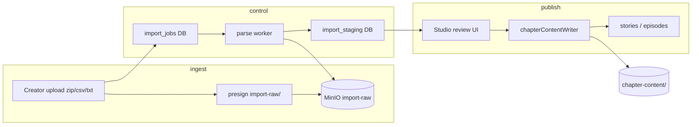

# ChapMee — Import pipeline plan (large translated corpus)

**Status:** Design only — complements [CHAPTER_CONTENT_STORAGE_PLAN.md](./CHAPTER_CONTENT_STORAGE_PLAN.md).  
**Context:** Large licensed/translated story sources must not inflate PostgreSQL; raw files and canonical chapter bodies belong in object storage with job tracking in DB.

---

## Current import behavior (baseline)

| Aspect | Today |
|--------|--------|
| Entry | Studio UI → CSV upload |
| Server | `lib/studio/import-export-v2-server.ts` |
| Format | `types/studio-import-v2.ts` headers (`content`, `structured_content_json`) |
| Persistence | **Direct** `INSERT`/`UPDATE` on `stories`, `episodes` with inline `content` |
| Jobs | `studio_import_export_jobs` — row counts, status, `error_summary` JSON |
| Raw files | **Not** stored; CSV parsed in memory |
| Staging | **None** — immediate publish to production tables |
| S3 | **Not used** for import payloads |

**Gaps for large corpus:** memory pressure on huge CSV, no resume, no dedup by hash, no review queue, no legal attestation trail, DB bloat.

---

## Target architecture



---

## Raw import storage (S3)

### Layout

```
import-raw/{job_id}/{original_filename}
import-raw/{job_id}/manifest.json          -- optional file list + sizes
import-staging/{job_id}/rows/{row_index}.json
import-staging/{job_id}/errors/{row_index}.json
```

### Upload path

1. Studio requests presign: `POST /api/import/presign` (new) with `job_id`, filename, size.
2. Client uploads to `import-raw/{job_id}/...`.
3. `POST /api/import/complete` registers row in `import_job_files` (optional table) with hash.

**Reuse:** `lib/storage/s3.ts` presign patterns from `app/api/media/presign-upload/route.ts`.

### Supported source formats (phased)

| Phase | Formats |
|-------|---------|
| 1 | CSV (current v2 headers), UTF-8 |
| 2 | `.txt` per chapter, folder zip |
| 3 | EPUB / custom translator JSON (adapter per source) |

**Do not** import real copyrighted content without rights — operational policy below.

---

## Import job schema (DB)

Extend beyond `studio_import_export_jobs` or add dedicated table:

```sql
create table if not exists public.content_import_jobs (
  id uuid primary key default gen_random_uuid(),
  owner_id uuid not null references public.profiles(id) on delete cascade,
  job_type text not null,  -- 'studio_csv' | 'bulk_txt' | 'archive_zip'
  status text not null default 'pending',
  -- pending | uploading | parsing | staged | review | publishing | completed | failed | cancelled
  source_object_key text,           -- primary raw file in S3
  source_filename text,
  source_size_bytes bigint,
  source_content_hash text,
  parser_version text not null default '1',
  total_rows integer default 0,
  parsed_rows integer default 0,
  staged_rows integer default 0,
  published_rows integer default 0,
  error_rows integer default 0,
  options jsonb not null default '{}'::jsonb,  -- delimiter, encoding, story mapping
  error_summary jsonb not null default '[]'::jsonb,
  rights_attestation jsonb,        -- see Legal section
  created_at timestamptz not null default now(),
  started_at timestamptz,
  completed_at timestamptz
);

create table if not exists public.content_import_staging_rows (
  id uuid primary key default gen_random_uuid(),
  job_id uuid not null references public.content_import_jobs(id) on delete cascade,
  row_index integer not null,
  story_external_key text,
  chapter_order integer,
  title text,
  content_format text,
  staging_object_key text,         -- import-staging/{job_id}/rows/{n}.json
  content_hash text,
  size_bytes bigint,
  validation_status text,          -- pending | valid | invalid | warning
  validation_errors jsonb default '[]'::jsonb,
  target_story_id uuid,
  target_episode_id uuid,          -- set after publish
  publish_status text default 'pending',  -- pending | published | skipped | failed
  created_at timestamptz not null default now(),
  unique (job_id, row_index)
);

create index idx_content_import_jobs_owner_created
  on public.content_import_jobs(owner_id, created_at desc);
```

**Bridge:** Keep `studio_import_export_jobs` for UI history; `content_import_jobs` holds S3-native pipeline (FK or shared `id`).

---

## Parser / staging

### Parser responsibilities

1. Stream-read CSV from S3 (avoid loading entire file into RAM).
2. Normalize rows to **staging envelope** (same canonical shape as chapter storage plan).
3. Validate headers (`STORIES_IMPORT_V2_HEADERS`, `CHAPTERS_IMPORT_V2_HEADERS`).
4. Reuse validators:
   - `validateStoryImportV2Row` (`lib/studio/story-import-taxonomy.ts`)
   - `validateStructuredContentForImport` (`lib/presentation/parse-structured.ts`)
   - `runComposerImportValidation` (`lib/composer/publish-validation.ts`)
5. Write one staging JSON per row to S3; insert `content_import_staging_rows` summary.

### Staging row JSON (example)

```json
{
  "v": 1,
  "story_external_key": "EXT-001",
  "story_code": "123456",
  "chapter_order": 12,
  "title": "Chương 12",
  "content_format": "plain_text",
  "content": "...",
  "structured_content": null,
  "import_metadata": {
    "source_line": 450,
    "source_file": "chapters.csv"
  }
}
```

### Worker execution

| Option | When |
|--------|------|
| Inline (server action chunk) | Small jobs < 500 rows |
| Background worker | Large jobs — Node script or queue consumer |
| Cron resume | Stuck `parsing` jobs |

**Local:** run worker via `pnpm import:worker` (future script).  
**Prod:** same VPS or separate worker container; **no Redis required** for MVP (DB status + polling).

---

## Deduplication

| Level | Method |
|-------|--------|
| File | Reject upload if `source_content_hash` matches recent job for same `owner_id` (optional warn) |
| Row | `(job_id, row_index)` unique; cross-job: `(story_id, episode_number, content_hash)` warn on publish |
| Story | `story_code` / `public_code` existing → update path (current v2 behavior) |
| Chapter | `chapter_code` or `episode_number` match → update vs create (current v2) |

**Content hash:** sha256 of canonical staging envelope bytes.

---

## Review / publish flow

### States

```
pending → uploading → parsing → staged → review → publishing → completed
                              ↘ failed
```

### Studio UX (future — not this prompt)

1. **Job list** — status, counts, errors download.
2. **Staging preview** — sample chapters, validation errors per row.
3. **Approve publish** — batch publish valid rows only.

### Publish transaction (per row)

1. Resolve or create `stories` row (reuse `import-export-v2-server` story insert logic).
2. Call `chapterContentWriter` — S3 canonical + episode metadata (see storage plan).
3. Set `publish_status = published`, link `target_episode_id`.
4. Apply monetization hooks (`applyChapterMonetizationFromImportRow` — existing).
5. Revalidate paths: `revalidatePath` for story/chapter URLs.

**Do not** copy staging JSON into `episodes.content` long-term when `storage_type=s3`.

---

## Failure handling

| Failure | Behavior |
|---------|----------|
| Parse error on row | `validation_status=invalid`, continue job, increment `error_rows` |
| S3 PUT fail | Retry 3x; row `publish_status=failed` |
| DB constraint | Row failed; story may partial — job `partially_completed` |
| Worker crash | Job stays `parsing`; resume from last `parsed_rows` |
| User cancel | `status=cancelled`; staging GC after TTL |

### `error_summary` shape

```json
[
  { "rowIndex": 12, "code": "INVALID_TAXONOMY", "message": "main_genre_slug không tồn tại" },
  { "rowIndex": 99, "code": "S3_PUT_FAILED", "message": "timeout" }
]
```

---

## Cleanup / lifecycle

| Asset | TTL / rule |
|-------|------------|
| `import-raw/` | Delete 30 days after job `completed` or `failed` |
| `import-staging/` | Delete 14 days after publish or cancel |
| `content_import_staging_rows` | Archive or delete with job |
| Failed jobs | Keep raw 7 days for debug |

**Cron:** extend `scripts/media-cleanup-todo.md` → `scripts/import-cleanup.mjs` with policy keys in `cleanup_policies`.

**Orphan detection:** staging keys without DB row → `orphan_candidate` pattern (mirror media cleanup).

---

## Legal / copyright warning

**Operational requirements (product + admin):**

1. **Attestation checkbox** on import start: creator confirms they have rights to upload and publish.
2. Store in `content_import_jobs.rights_attestation`: `{ "confirmed_at", "user_id", "ip", "text_version" }`.
3. **Do not** ship seed scripts with real translated novels in repo.
4. Admin audit: link job → owner → source filename for DMCA traceability.
5. Block public domain scraper URLs in parsers (policy).

**Disclaimer copy (Studio):** Vietnamese + English short notice before first bulk import.

---

## Integration with existing modules

| Module | Role in new pipeline |
|--------|----------------------|
| `lib/studio/import-export-v2-server.ts` | Refactor: parse → stage → publish; keep CSV API surface |
| `lib/studio/import-export-jobs.ts` | Map to `content_import_jobs` or dual-write |
| `types/studio-import-v2.ts` | Unchanged headers |
| `lib/studio/import-export-templates.ts` | Document staging + S3 |
| `lib/creator/createEpisode.ts` | Publish path delegates to `chapterContentWriter` |
| `lib/content/chapter-content-writer.ts` | **New** — canonical S3 write |
| `app/api/media/presign-upload/route.ts` | Pattern for `app/api/import/presign-upload/route.ts` |

---

## Migration from current CSV import

| Step | Action |
|------|--------|
| 1 | Add tables + S3 prefixes; no behavior change |
| 2 | Feature flag `IMPORT_PIPELINE_V3=1` — new jobs use staging |
| 3 | Default small CSV to fast path (inline publish) for Studio UX |
| 4 | Large jobs (`source_size_bytes > 5MB` or row count > 2000) force staging path |
| 5 | Deprecate in-memory-only large imports |

**Backward compatible:** existing `studio_import_export_jobs` rows remain historical.

---

## Security

- Presign: restrict `import-raw/{job_id}/*` to job owner; short TTL (15 min).
- Complete: verify ownership + job status `uploading`.
- RLS on `content_import_jobs` / staging: `owner_id = auth.uid()`.
- Service role worker: only `parsing` → `staged` transitions.
- Scan: optional ClamAV hook on raw zip (production hardening).

---

## Observability

- Log per job: `job_id`, duration, bytes read/written.
- Metrics: `import_jobs_completed`, `import_rows_failed`, `import_s3_bytes_stored`.
- Admin dashboard: reuse `lib/admin/get-content-taxonomy-quality-page-data.ts` pattern for import job counts.

---

## Validation checklist

- [ ] Upload 10MB CSV → raw in S3, job `staged`, DB not containing full text in staging table
- [ ] Publish 1 row → reader shows chapter; `content_object_key` set
- [ ] Failed row does not block others (`partially_completed`)
- [ ] Resume interrupted parse
- [ ] Dedup warns on duplicate hash
- [ ] Raw objects deleted after TTL
- [ ] Attestation required before parse
- [ ] No copyrighted sample data in tests (fixtures are synthetic)

---

## Suggested next prompts (implementation order)

1. **Prompt 2:** SQL migration `content_import_jobs` + `episodes` storage columns (phase 1 schema only).
2. **Prompt 3:** `lib/content/chapter-content-resolver.ts` + writer + unit tests with MinIO local.
3. **Prompt 4:** Wire reader (`getEpisodeReaderData`) behind flag.
4. **Prompt 5:** Wire `createEpisode` / `updateEpisode` dual-write.
5. **Prompt 6:** Import presign + staging worker + Studio job UI (minimal).
6. **Prompt 7:** Backfill script + ops runbook for Vietnix sync.

---

## Related

- [STORAGE_ARCHITECTURE_AUDIT.md](./STORAGE_ARCHITECTURE_AUDIT.md)
- [CHAPTER_CONTENT_STORAGE_PLAN.md](./CHAPTER_CONTENT_STORAGE_PLAN.md)
- [docs/taxonomy-import-export.md](./taxonomy-import-export.md) — admin taxonomy CSV (separate)
