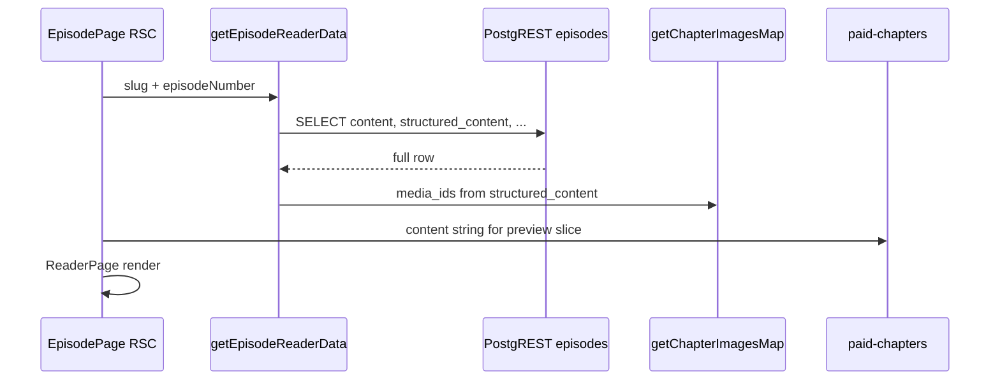
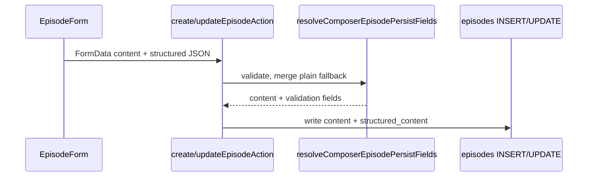

# ChapMee — Storage architecture audit (large story corpus)

**Date:** 2026-06-02  
**Scope:** Original audit; **implementation completed** in follow-up passes (see below).  
**Stack context:** PostgreSQL + PostgREST (local/prod), MinIO/S3 for media, Better Auth; Supabase SDK removed from app runtime; legacy SQL in `db/migrations/legacy/`.

### Implementation status (MVP complete)

| Area | Status | References |
|------|--------|------------|
| Chapter body in S3 | Done | `drizzle/0008`, `lib/storage/chapter-content-storage.ts`, reader hydrate |
| Import pipeline | Done | `drizzle/0009`, `/admin/imports`, `docs/IMPORT_PIPELINE.md` |
| DB search (no S3 reads) | Done | `drizzle/0010`, `lib/search/*` |
| Redis chapter cache | Done | `lib/cache/chapter-content-cache.ts` |
| Ops / integrity | Done | `storage:health`, `storage:check-*`, `storage:scheduled-dry-run` |
| Admin last-check | Done | `drizzle/0011`, `/admin/storage` |
| Runbook | Done | [OPERATIONS_STORAGE.md](./OPERATIONS_STORAGE.md) |

---

## Executive summary

Today, **full chapter body lives in PostgreSQL** (`episodes.content` + optional `episodes.structured_content` JSONB). Standalone stories store full body on **`stories`** (`standalone_content_json`, `standalone_plain_text`). **Images** already use **S3/MinIO** via `storage_assets` / `media_assets` with stable `path` (object key). **Redis** is provisioned locally (`docker-compose.local.yml`) but **not used** by application code for chapter caching yet.

There is **no** `content_object_key`, `content_storage_type`, or chapter blob layer. Bulk import (Studio CSV v2) **writes chapter text directly into `episodes` rows**. Public search indexes **story metadata** (FTS) and **chapter title/excerpt** only — not full chapter bodies.

Recommended direction: **hybrid storage** — DB keeps metadata, permissions, previews, hashes; MinIO/S3 holds full payloads; a **reader/editor resolver** chooses source without UI/routing changes.

---

## Audit questions (answers)

| Question | Answer |
|----------|--------|
| What do chapters store today? | Table `public.episodes`: `content` (text), `excerpt`, `structured_content` (jsonb), `content_format`, `presentation_mode`, composer validation columns, SEO fields, monetization via separate tables. |
| Is there `content_json` in DB? | **No column named `content_json`.** Closest: `episodes.structured_content` (jsonb), `stories.standalone_content_json`, import CSV field `structured_content_json`, draft `creator_drafts.content` (jsonb). |
| Is there `plain_text` in DB? | **Yes** — `stories.standalone_plain_text`, `creator_drafts.plain_text`, `creator_draft_versions.plain_text`, `creator_templates.plain_text`, studio draft helpers; episodes use **`content`** (plain/markdown/rich) not a separate `plain_text` column. |
| Rich composer blocks? | **Yes** — `content_format = 'structured_blocks'`, body in `structured_content` (Composer v1 document); plain fallback duplicated into `content` on persist. |
| Does reader read directly from DB? | **Yes** — `getEpisodeReaderData` selects `content`, `structured_content` from PostgREST; episode page renders via `ReaderPage`. |
| Chapter save/read APIs? | **Server actions:** `createEpisodeAction`, `updateEpisodeAction`; **import:** `import-export-v2-server.ts`; **drafts:** `lib/studio/save-draft.ts`; **reader:** `lib/episodes/getEpisodeReaderData.ts`. No dedicated REST route for chapter body beyond PostgREST RLS. |
| Story import exists? | **Yes** — Studio CSV v2 (`lib/studio/import-export-v2-server.ts`), jobs in `studio_import_export_jobs`; taxonomy admin jobs separate. Import is **inline CSV → DB**, not raw files → S3. |
| Search depends on full plain text? | **No for chapters** — episode search uses `title`, `excerpt` ilike; story FTS uses `title`, `hook`, `short_description` only. Standalone `standalone_plain_text` is documented for search/SEO but **not** in `stories.search_vector` trigger today. |
| `media_assets` / S3 abstraction? | **Yes for images** — `lib/storage/*`, `lib/media/*`, presign APIs, `storage_assets` + view `media_assets`. **Not** used for chapter text bodies. |
| Redis/cache? | **Infra only** — Redis container local; **no** app chapter cache layer found. |
| Lifecycle cleanup? | **Media** — `lib/storage/cleanup-service.ts`, admin UI, policies in migration 198; **cron TODO** (`scripts/media-cleanup-todo.md`). **No** chapter content blob lifecycle. |

---

## Current state

### Data model (PostgreSQL)

| Entity | Primary content columns | Notes |
|--------|-------------------------|--------|
| `episodes` | `content text NOT NULL`, `structured_content jsonb`, `excerpt text` | Initial schema `001_initial_schema.sql`; presentation `171`, composer `173`. |
| `stories` (standalone) | `standalone_content_json`, `standalone_plain_text`, `standalone_word_count` | `175_story_structure_type.sql` |
| `creator_drafts` | `content jsonb`, `plain_text text` | Autosave / versions `072_creator_drafts.sql` |
| `creator_templates` | `content`, `plain_text` | Templates search uses ilike on plain_text |
| `storage_assets` / `media_assets` | `bucket`, `path`, `size_bytes`, `checksum` | Images & uploads; view `198_media_optimization_foundation.sql` |

**Not present (target fields):** `content_storage_type`, `content_object_key`, `content_hash`, `content_size_bytes`, `plain_text_preview` (beyond `excerpt`).

### Naming: episodes vs chapters

- **DB table:** `public.episodes`
- **Product language:** chapter
- **Routes:** `/stories/[slug]/episodes/[episodeNumber]` (+ canonical chapter URLs via `lib/urls`)

### Content formats (`episodes.content_format`)

From migrations / code: `plain_text`, `markdown`, `rich_text`, `structured_json`, `structured_blocks` (Composer).

`structured_content` holds presentation-specific JSON (chat_story, case_file, diary, system_game) or Composer block document.

---

## Found files / modules

### Schema & migrations

| Path | Role |
|------|------|
| `db/migrations/legacy/001_initial_schema.sql` | `episodes.content`, `excerpt`, `word_count` |
| `db/migrations/legacy/171_episode_presentation.sql` | `structured_content`, `content_format`, `presentation_mode` |
| `db/migrations/legacy/173_studio_composer_episodes.sql` | Composer validation columns |
| `db/migrations/legacy/175_story_structure_type.sql` | Standalone story columns |
| `db/migrations/legacy/179_stories_search_vector.sql` | `stories.search_vector`, RPC `search_public_story_ids` |
| `db/migrations/legacy/167_studio_import_export_jobs.sql` | Import/export job metadata |
| `db/migrations/legacy/198_media_optimization_foundation.sql` | `storage_assets`, `media_assets` view, cleanup policies |
| `drizzle/0000_foundation.sql` | Auth only; **no** episodes in Drizzle yet |

### Reader

| Path | Role |
|------|------|
| `lib/episodes/getEpisodeReaderData.ts` | Loads `content`, `structured_content` from DB |
| `app/stories/[slug]/episodes/[episodeNumber]/page.tsx` | Episode page, monetization gates, `ReaderPage` |
| `components/reader/ReaderPage.tsx` | Renders chapter UI |
| `lib/monetization/paid-chapters.ts` | `buildPreviewContent` slices **in-memory** `content` string |
| `lib/monetization/early-access.ts` | Access gating (metadata DB) |
| `lib/images/get-chapter-images-map.ts` | Composer `media_id` → chapter images |
| `lib/composer/collect-media-ids.ts` | Extract media refs from structured JSON |

### Editor / composer

| Path | Role |
|------|------|
| `lib/creator/createEpisode.ts` | Insert episode with `content`, `structured_content` |
| `lib/creator/updateEpisode.ts` | Update episode body in DB |
| `lib/creator/resolve-composer-episode-persist.ts` | Validation; merge Composer → `content` |
| `lib/creator/parse-episode-presentation.ts` | Form → presentation fields |
| `lib/creator/persist-standalone-story-content.ts` | Standalone body on `stories` |
| `lib/creator/getCreatorEpisodeById.ts` | Studio load chapter |
| `components/creator/episodes/EpisodeForm.tsx` | Creator chapter form |
| `components/studio/episodes/*` | Studio episode UX |
| `lib/studio/save-draft.ts` | `creator_drafts` autosave (jsonb + plain_text) |
| `lib/media/content-media-validator.ts` | Blocks localhost / public uploads in content |

### Import / export

| Path | Role |
|------|------|
| `lib/studio/import-export-v2-server.ts` | CSV import/export → `episodes` / `stories` |
| `lib/studio/import-export-jobs.ts` | `studio_import_export_jobs` CRUD |
| `types/studio-import-v2.ts` | CSV headers (`content`, `structured_content_json`) |
| `lib/studio/import-export-templates.ts` | Template docs for creators |
| `lib/taxonomy/import-export/*` | Admin taxonomy CSV (separate) |

### Search

| Path | Role |
|------|------|
| `lib/search/collect-candidates.ts` | Stories FTS + episode title/excerpt ilike |
| `lib/stories/search-public-stories.ts` | RPC `search_public_story_ids` |

### Media / object storage

| Path | Role |
|------|------|
| `lib/storage/s3.ts` | S3 client (MinIO-compatible), presign, delete |
| `lib/storage/media-paths.ts` | Key conventions (`chapter-media/`, etc.) |
| `lib/storage/asset-service.ts` | Register/link assets |
| `lib/storage/cleanup-service.ts` | Admin storage cleanup |
| `lib/media/media-url.ts` | Resolve public URL; reject localhost in content |
| `app/api/media/presign-upload/route.ts` | Presigned upload |
| `app/api/media/complete-upload/route.ts` | Complete + register asset |
| `app/api/chapter-images/upload/route.ts` | Chapter image upload |
| `MEDIA_PLATFORM.md`, `LOCAL_MEDIA_MIGRATION.md` | Media docs |

### Infra

| Path | Role |
|------|------|
| `docker-compose.local.yml` | Postgres, Redis, MinIO, PostgREST |
| `INFRA_MIGRATION.md` | Supabase removal status |
| `DEPLOY_VIETNIX.md` | Prod stack notes |

---

## Current schema assumptions (episodes)

```sql
-- Simplified from 001 + 171 + 173
episodes (
  id uuid PK,
  story_id uuid FK,
  episode_number int,
  title text,
  content text NOT NULL,           -- full body (plain or derived from composer)
  excerpt text,
  structured_content jsonb,        -- optional large JSON
  content_format text,
  presentation_mode text,
  word_count int,
  composer_version int,
  validation_status text,
  validation_errors jsonb,
  status content_status,
  ...
)
```

**Size risk:** `content` + `structured_content` both populated for Composer chapters (duplication). Large translated corpora multiply storage and WAL.

---

## Current reader flow



- **No S3 fetch** for text.
- **No Redis** layer.
- Paid preview operates on **full `content` already loaded** (privacy/perf concern when content moves to S3 — resolver should pass preview from DB excerpt or precomputed preview).

---

## Current editor / composer flow



**Draft path:** `save-draft.ts` → `creator_drafts` / `creator_draft_versions` (also DB-heavy).

---

## Current media / upload flow

- Binary media: **MinIO/S3** + `storage_assets` registry.
- URLs in content: **object keys** or `media_id` references — validated against localhost/`/public/uploads` at publish (`content-media-validator.ts`).
- Chapter **text** never goes through presign pipeline.

---

## Risks

| Risk | Severity | Detail |
|------|----------|--------|
| DB bloat | **High** | Full corpus in `episodes.content` + jsonb duplicates. |
| Backup/restore time | **High** | Postgres dumps include all chapter text. |
| Import burst | **High** | CSV import writes huge rows synchronously in server actions. |
| Composer duplication | **Medium** | Plain `content` + `structured_content` both stored. |
| Paid preview loads full body | **Medium** | Before unlock, full content may still be fetched server-side unless gated at resolver. |
| Search gap for standalone | **Low** | `standalone_plain_text` not in `search_vector` trigger. |
| Draft table growth | **Medium** | `creator_drafts` stores full jsonb per autosave. |
| No chapter blob GC | **Medium** | Orphan S3 keys after delete not applicable yet (no blobs). |
| Migration drift | **Low** | Drizzle foundation ≠ full domain schema; legacy SQL is source of truth. |

---

## Recommended migration path (phased, non-destructive)

Aligned with [CHAPTER_CONTENT_STORAGE_PLAN.md](./CHAPTER_CONTENT_STORAGE_PLAN.md) and [IMPORT_PIPELINE_PLAN.md](./IMPORT_PIPELINE_PLAN.md).

| Phase | Goal | App impact |
|-------|------|------------|
| **0** | Document + size thresholds (this audit) | None |
| **1** | Add nullable columns on `episodes` / `stories` (`content_storage_type`, `content_object_key`, `content_hash`, `content_size_bytes`, `plain_text_preview`) | None if defaults keep `db` |
| **2** | Implement `lib/content/chapter-content-resolver.ts` (read) + `chapter-content-writer.ts` (write); dual-write new chapters over threshold | Internal lib only |
| **3** | Backfill job: copy large rows to S3, set metadata, **keep** DB columns for rollback | Background script |
| **4** | Switch reader/editor/import to resolver; optional Redis cache | No route/UI change |
| **5** | Stop writing full body to DB for `storage_type=s3` (retain excerpt/preview/hash) | DB size relief |
| **6** | Import pipeline: raw files → S3, jobs table, staging | Studio-only |

**Constraints honored:** no Supabase reintroduction; no destructive drops; backward compatible reads (`storage_type=db` reads existing columns).

---

## Related documentation

- [CHAPTER_CONTENT_STORAGE_PLAN.md](./CHAPTER_CONTENT_STORAGE_PLAN.md) — target schema, keys, flows
- [IMPORT_PIPELINE_PLAN.md](./IMPORT_PIPELINE_PLAN.md) — bulk translated corpus ingestion
- [MEDIA_PLATFORM.md](../MEDIA_PLATFORM.md) — existing media keys (extend parallel tree for `chapter-content/`)

---

## Validation performed (this pass)

- Codebase keyword scan: `episodes`, `structured_content`, `plain_text`, `composer`, `reader`, `media_assets`, `import`, `s3`, `minio`
- No runtime code changes
- `pnpm build` — see PR / agent report (run locally after doc commit)
