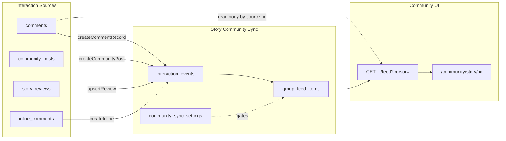

# Story Community Sync — Technical Audit & Implementation Plan

**Project:** ChapMee (ChapChap repo)  
**Date:** 2026-06-05  
**Scope:** Read-only audit — no feature implementation in this pass  
**Goal:** Xác định hiện trạng codebase và kế hoạch tích hợp Story Community Sync (mọi tương tác có giá trị quanh truyện → feed nhóm cộng đồng truyện, tham chiếu nguồn gốc, không copy dữ liệu thô).

---

## 1. Executive summary

ChapMee **đã có nền tảng community cơ bản** nhưng **chưa có Story Community Sync thật sự**:

| Khía cạnh | Hiện trạng |
|-----------|------------|
| Nhóm truyện | **Virtual** — 1:1 với `stories.id`, ID synthetic `story-group-{uuid}`. Không có bảng `story_groups`. |
| Feed nhóm truyện | Chỉ hiển thị `community_posts` lọc theo `story_id`. **Không** gom bình luận chương / Reels / inline / review có cấu trúc. |
| Feed cộng đồng chung | Có cursor pagination qua `/api/community/feed`, nhưng bình luận truyện được **query trực tiếp** từ `comments` khi hết post batch — không phải projection bền vững. |
| Event/projection | Chưa có. Chỉ có pattern tương tự: `analytics_events`, `email_jobs`, `story_review_stats` aggregate. |
| UI feed lớn | `CommunityInfiniteFeed` dùng infinite scroll — **mâu thuẫn** yêu cầu pagination cho group feed mới. |
| Audio / Phim | Module có metadata + policy; **không có comment riêng**. |
| Drizzle | Partial — `stories`/`episodes`/`comments` nằm legacy SQL; Drizzle mới thêm reviews, inline comments, audio, films. |

**Khuyến nghị:** Không rewrite comment/community. Thêm **3 bảng projection mới** (`interaction_events`, `group_feed_items`, `community_sync_settings`), hook tại các điểm ghi hiện có, và thay feed nhóm truyện bằng API cursor-paginated đọc từ `group_feed_items`.

**Không tạo bảng `story_groups`** — tái sử dụng mô hình virtual group + mở rộng `community_group_settings` nếu cần flag sync.

---

## 2. Hiện trạng codebase

### 2.1 Naming & entity mapping

Trong code, **chương = `episodes`** (không phải `chapters`):

```29:36:lib/urls/constants.ts
export const ENTITY_TABLE: Record<PublicEntityType, string> = {
  story: "stories",
  chapter: "episodes",
  reel: "reels_items",
  ...
};
```

### 2.2 Story / Episode models

| Layer | Path | Ghi chú |
|-------|------|---------|
| Legacy schema | `db/migrations/legacy/001_initial_schema.sql` | `stories`, `episodes` |
| Drizzle (partial) | `lib/db/schema/content-origin.ts` | Origin/rights trên `stories` |
| Create/update | `lib/creator/createStory.ts`, `createEpisode.ts`, `updateStory.ts`, `updateEpisode.ts` | Server actions |
| Reader | `lib/stories/getStoryBySlug.ts`, `lib/episodes/getEpisodeReaderData.ts` | RSC data |
| Types | `types/story.ts`, `types/chapter.ts`, `types/story-structure.ts` | |

**Quan hệ chính:** `episodes.story_id → stories.id`. Satellite: `story_taxonomy_terms`, `story_presentation_settings`, `reading_progress`, `chapter_reactions`, `story_reviews`, `audio_items`, `story_film_adaptations`.

### 2.3 Comment systems (3 hệ + Reels reuse)

#### A. Story / episode / community-post comments — bảng `comments`

| File | Vai trò |
|------|---------|
| `lib/comments/createComment.ts` | **Điểm hook chính** — insert, spam, rate limit, analytics, fan score, notifications |
| `lib/comments/getComments.ts` | List phẳng |
| `lib/comments/getCommentThread.ts` | Thread + likes + pin |
| `lib/comments/reply-comment.ts` | Reply action |
| `lib/comments/toggleCommentLike.ts` | Like qua `reactions` |
| `lib/comments/deleteComment.ts` | Soft delete |
| `lib/comments/pinComment.ts`, `hide-comment.ts` | Creator/studio moderation |
| `lib/comments/community-post-comment-actions.ts` | Wrapper cho post cộng đồng |

**Schema gốc** (`001_initial_schema.sql`): `user_id`, `story_id`, `episode_id`, `parent_id`, `content`, `status`.  
**Mở rộng sau:** `community_post_id`, moderation fields (`ai_spam_suspected`, `moderation_status`, `is_pinned`, …) — qua legacy migrations.

**Ràng buộc tạo:** Hoặc `storyId` (+ optional `episodeId`), hoặc `communityPostId` — không cả hai.

#### B. Inline (passage) comments — bảng riêng

| File | Vai trò |
|------|---------|
| `drizzle/0014_inline_comments.sql` | `inline_comment_anchors`, `inline_comment_threads`, `inline_comments` |
| `lib/inline-comments/inline-comments.ts` | CRUD + cursor pagination (Drizzle raw SQL) |
| `lib/inline-comments/inline-comment-actions.ts` | Server actions |
| `components/reader/inline-comments/` | Reader UI |

Liên kết: `inline_comment_threads.chapter_id → episodes.id` → suy ra `story_id`.

#### C. Reels comments

Reels **không có bảng comment riêng** — dùng lại `comments` + `createCommentRecord`:

| File | Vai trò |
|------|---------|
| `app/api/reels/comments/route.ts` | GET thread, POST create |
| `app/api/reels/comments/[commentId]/like/route.ts` | Like |
| `app/api/reels/comments/[commentId]/pin/route.ts` | Pin |
| `components/reels/ReelsCommentSheet.tsx`, `ReelsCommentPanel.tsx` | UI |

Reels comment = `story_id` + `episode_id` (cùng episode đang xem trên Reels).

#### D. Structured story reviews — bảng `story_reviews`

| File | Vai trò |
|------|---------|
| `lib/db/schema/story-reviews.ts`, `drizzle/0013_story_reviews.sql` | Schema + migration |
| `lib/reviews/story-reviews.ts` | CRUD, stats refresh |
| `lib/reviews/story-review-actions.ts` | Server actions |
| `components/story/reviews/` | UI tab Reviews |

**Khác** community post `type='review'` (freeform, không sao).

### 2.4 Community / group hiện tại

#### Virtual story groups (không có bảng `story_groups`)

| File | Vai trò |
|------|---------|
| `lib/community/get-story-groups.ts` | Build `StoryCommunityGroup[]` từ `stories` public |
| `lib/community/get-story-group-by-slug.ts` | Resolve group theo slug/uuid |
| `types/community.ts` | `StoryCommunityGroup`, `CommunityFeedItem` |
| `app/community/story/[storyId]/page.tsx` | Trang nhóm truyện |
| `components/community/StoryGroupFeed.tsx` | Sub-tabs feed/hot/review/poll/theory |

**Group ID:** `story-group-{story.id}`  
**Group key thực:** `story.id` (UUID)  
**Settings admin:** `community_group_settings` (`group_type='story'`, `group_id=storyId`) — migration `096_admin_community_moderation.sql`

#### Community posts & feed

| File | Vai trò |
|------|---------|
| `lib/community/createCommunityPost.ts` | Tạo post + auto-moderation |
| `lib/community/get-community-feed.ts` | Feed paginated (posts + comment batch) |
| `lib/community/build-unified-feed.ts` | Map → `CommunityFeedItem` kinds |
| `lib/community/community-feed-cursor.ts` | Cursor encode/decode |
| `app/api/community/feed/route.ts` | GET API |
| `components/community/CommunityInfiniteFeed.tsx` | Client infinite scroll |

**Bảng:** `community_posts`, `community_moderation_decisions`, `community_auto_moderation_settings`, `community_group_settings`

**Feed item kinds hiện có** (`types/community.ts`): `user_post`, `story_group_post`, `story_comment_highlight`, `author_reply`, `review`, `poll`, `challenge`, `chapter_discussion`, `author_group_post`.

**Lưu ý quan trọng:** `build-unified-feed.ts` vẫn có **dữ liệu synthetic** (hash-based fake hot score, poll votes, highlight quotes, author reply giả). Đây là MVP UI polish, **không phải sync thật**.

#### Trang nhóm truyện — gap lớn

```36:38:app/community/story/[storyId]/page.tsx
  const storyPosts = feed.posts.filter(
    (post) => post.storyId === story.id || post.relatedStorySlug === story.slug
  );
```

- Gọi `getCommunityFeed()` **không filter story**, load toàn bộ posts rồi lọc in-memory.
- **Không pagination** cho story group.
- **Không** hiển thị comment chương / Reels / inline / `story_reviews` từ nguồn gốc.

### 2.5 Audio module

| Area | Path |
|------|------|
| Schema | `lib/db/schema/audio-companion.ts`, `drizzle/0021_audio_companion_story_level.sql` |
| Logic | `src/lib/audio/` |
| Admin/Studio | `app/admin/audio/`, `app/studio/.../audio/` |
| Public | `app/audio/page.tsx` |

**Không có comment/audio interaction table.** Chỉ `audio_items` (story-level, external URL / YouTube) + `audio_listening_progress`.

### 2.6 Film / adaptation module

| Area | Path |
|------|------|
| Schema | `lib/db/schema/film-adaptations.ts`, `drizzle/0022_story_film_adaptations.sql` |
| Logic | `src/lib/film-adaptations/` |
| Docs | `docs/FILM_ADAPTATIONS_ARCHITECTURE.md` |

**Không có comment trên phim.** Chỉ `story_film_adaptations` (YouTube embed, story-level).

### 2.7 Chapter reactions (không phải comment)

| File | Bảng |
|------|------|
| `lib/db/schema/chapter-reactions.ts` | `chapter_reactions`, `chapter_reaction_types` |
| `lib/reactions/chapter-reactions.ts` | Toggle reaction |

Có thể sync sang group feed như loại `chapter_reaction` (optional phase 2).

### 2.8 Auth / user / role

| Layer | Path |
|-------|------|
| Auth | Better Auth — `lib/auth/auth.ts`, `lib/db/schema/auth.ts` |
| Profile roles (legacy) | `user`, `admin`, `moderator`, `founder` — `profiles.role` |
| RBAC | `roles`, `user_roles`, `role_permissions` — seed legacy `052`–`057` |
| Permissions | `types/permissions.ts`, `lib/auth/permissions.ts` |
| Guards | `lib/auth/require-permission.ts`, `proxy.ts` (admin routes) |

**Permissions liên quan community:** `comment.create`, `community.post.create`, `community.group.moderate`, `community.post.moderate`, …

### 2.9 Database & migrations

**Pipeline 3 phase:**

| Phase | Script | Files |
|-------|--------|-------|
| Foundation | `npm run db:migrate` | `drizzle/0000`–`0005` |
| Legacy | `npm run db:legacy` | `db/migrations/legacy/*.sql` (~198 files) |
| Extensions | `npm run db:shims` | `drizzle/0006`–`0030` |

Tracking: `public.schema_migrations`

**Drizzle schema index:** `lib/db/schema/index.ts` — không export full `stories`/`comments`.

**Legacy source:** `db/migrations/legacy/` (sync từ `supabase/migrations/`). Community tables từ legacy, ví dụ:
- `001_initial_schema.sql` — `comments`, `community_posts`
- `096_admin_community_moderation.sql` — `community_group_settings`
- `097_community_auto_moderation.sql` — auto-mod fields

**Supabase runtime:** Đã bỏ `@supabase/supabase-js`; app dùng `lib/data/server.ts` + PostgREST compat. Legacy SQL vẫn giữ RLS/policy shape.

### 2.10 Deploy local & VPS

| Doc | Path |
|-----|------|
| Local | `LOCAL_SETUP.md` |
| VPS runbook | `docs/DEPLOY_VIETNIX_PRODUCTION.md` |
| Docker prod | `docker-compose.production.yml`, `Dockerfile` |
| Backup | `scripts/deploy/backup-postgres.sh`, `backup-all.sh` |

**Local quick path:**
```powershell
npm run docker:local:up
npm run db:setup    # migrate + legacy + shims
npm run db:seed
npm run verify:local
npm run dev
```

**VPS migration (trong container web):**
```bash
dcp exec web node scripts/db-migrate-foundation.mjs
dcp exec web node scripts/db-apply-legacy-migrations.mjs
dcp exec web node scripts/db-apply-shims.mjs
# Extension mới (Story Community Sync): thêm bước apply 0031+ sau backup
```

---

## 3. Bảng hiện có (liên quan trực tiếp)

| Bảng | Vai trò với sync | Ghi chú |
|------|------------------|---------|
| `stories` | Group identity | Virtual group 1:1 |
| `episodes` | Chapter context | `story_id` FK |
| `comments` | Nguồn chính: story/chapter/Reels/community-post reply | Không copy content vào feed |
| `inline_comment_threads`, `inline_comments` | Nguồn passage comments | Riêng biệt |
| `community_posts` | User posts trong group | Đã có `story_id`, `episode_id` |
| `community_group_settings` | Admin: lock posting, hide recommendation | **Tái sử dụng** — không trùng với sync settings |
| `community_auto_moderation_settings` | Global auto-mod | Tách biệt |
| `community_moderation_decisions` | Audit trail | |
| `story_reviews`, `story_review_stats` | Structured reviews | Aggregate pattern tham khảo |
| `reactions` | Comment likes | Optional sync (phase 2) |
| `chapter_reactions` | Emoji reactions | Optional sync (phase 2) |
| `audio_items` | Audio metadata | Chưa có comment |
| `story_film_adaptations` | Film metadata | Chưa có comment |
| `analytics_events` | Analytics only | Không thay projection |
| `notifications` | User notify | Song song, không thay feed |

**Không tồn tại:** `story_groups`, `interaction_events`, `group_feed_items`, `community_sync_settings`.

---

## 4. Điểm gắn event (integration hooks)

### 4.1 Ưu tiên Phase 1 (MVP)

| Sự kiện | Hook file | Function | `source_type` đề xuất |
|---------|-----------|----------|------------------------|
| Tạo comment story/chapter | `lib/comments/createComment.ts` | `createCommentRecord()` | `comment` |
| Reply comment | same | same (có `parentId`) | `comment_reply` |
| Tác giả trả lời | same | detect `user.id === creator_profiles.user_id` | `author_reply` |
| Comment Reels | `app/api/reels/comments/route.ts` | → `createCommentRecord()` | `comment` (context `surface=reels`) |
| Comment community post (có `story_id`) | `createComment.ts` | `communityPostId` path | `community_post_comment` |
| Tạo community post gắn story | `lib/community/createCommunityPost.ts` | sau insert approved | `community_post` |
| Upsert story review | `lib/reviews/story-reviews.ts` | sau insert/update visible | `story_review` |
| Inline comment / reply | `lib/inline-comments/inline-comments.ts` | `createInlineComment`, `replyToInlineThread` | `inline_comment` |

### 4.2 Phase 2 (mở rộng)

| Sự kiện | Hook | `source_type` |
|---------|------|---------------|
| Comment like (ngưỡng hot) | `lib/comments/toggleCommentLike.ts` | `comment_like_milestone` |
| Chapter reaction | `lib/reactions/chapter-reactions.ts` | `chapter_reaction` |
| Hide/delete comment | `deleteComment.ts`, hide actions | projection `status=hidden` |
| Moderation hide review/post | admin actions | update feed item visibility |
| Audio comment (khi có module) | TBD | `audio_comment` |
| Film comment (khi có module) | TBD | `film_comment` |

### 4.3 Kiến trúc hook (không block request)

```
User action
  → existing write (comments / posts / reviews / inline)
  → emitInteractionEvent()     // insert interaction_events (idempotent)
  → projectGroupFeedItem()       // upsert group_feed_items (reference only)
  → optional: revalidatePath / invalidate cache
```

Chạy **đồng bộ trong transaction** nếu đơn giản MVP; hoặc fire-and-forget + retry queue (phase 2) nếu latency là vấn đề.

---

## 5. Nhóm truyện — tái sử dụng vs bảng mới

### Kết luận: **Không tạo `story_groups`**

Lý do:
- Mỗi truyện public đã có nhóm ảo qua `getStoryGroups()` / `StoryCommunityGroup`.
- Admin settings đã có `community_group_settings (group_type='story', group_id=storyId)`.
- Thêm bảng `story_groups` sẽ duplicate `stories` và phải backfill/sync.

### Thay vào đó

- **`group_id` trong projection = `stories.id`**
- **`group_type` = `'story'`** (consistent với settings hiện có)
- Optional Phase 2: materialized counters trên `stories` hoặc bảng `story_group_stats` — chỉ khi cần performance, không bắt buộc MVP.

---

## 6. Data model đề xuất (tối thiểu)

Migration đề xuất: **`drizzle/0031_story_community_sync.sql`** (+ Drizzle schema `lib/db/schema/story-community-sync.ts`).

### 6.1 `interaction_events` (append-only, idempotency)

```sql
create table public.interaction_events (
  id uuid primary key default gen_random_uuid(),
  story_id uuid not null references public.stories(id) on delete cascade,
  event_type text not null,
  -- comment | comment_reply | author_reply | community_post | community_post_comment
  -- | story_review | inline_comment | inline_comment_reply | chapter_reaction (phase 2)
  source_type text not null,
  source_id uuid not null,
  -- FK logic ở app layer; không hard FK đa bảng
  parent_source_type text,
  parent_source_id uuid,
  actor_user_id uuid references public.profiles(id) on delete set null,
  surface text,  -- 'story_page' | 'chapter_reader' | 'reels' | 'community' | 'inline' | ...
  episode_id uuid references public.episodes(id) on delete set null,
  community_post_id uuid references public.community_posts(id) on delete set null,
  metadata jsonb not null default '{}'::jsonb,
  -- spoiler flag, moderation snapshot, excerpt hash, etc.
  dedupe_key text not null,
  created_at timestamptz not null default now(),
  unique (dedupe_key)
);

create index idx_interaction_events_story_created
  on public.interaction_events (story_id, created_at desc);
create index idx_interaction_events_source
  on public.interaction_events (source_type, source_id);
```

**`dedupe_key` ví dụ:** `{event_type}:{source_type}:{source_id}` — chống double-insert khi retry.

### 6.2 `group_feed_items` (projection — reference only)

```sql
create table public.group_feed_items (
  id uuid primary key default gen_random_uuid(),
  group_type text not null default 'story'
    check (group_type in ('story')),  -- mở rộng 'author' sau
  group_id uuid not null,  -- = story_id
  story_id uuid not null references public.stories(id) on delete cascade,
  item_kind text not null,
  -- mirror CommunityFeedItemKind subset: story_comment_highlight, author_reply,
  -- story_group_post, review, inline_comment, chapter_discussion, ...
  source_type text not null,
  source_id uuid not null,
  interaction_event_id uuid references public.interaction_events(id) on delete set null,
  episode_id uuid references public.episodes(id) on delete set null,
  actor_user_id uuid references public.profiles(id) on delete set null,
  -- Display helpers (denormalized nhẹ, không copy body):
  title_snapshot text,
  excerpt_snapshot text,  -- max ~200 chars, lấy lúc project; refresh khi source edit (phase 2)
  is_spoiler boolean not null default false,
  is_author boolean not null default false,
  hot_score numeric(10,2) not null default 0,
  status text not null default 'visible'
    check (status in ('visible', 'hidden', 'moderated', 'deleted')),
  created_at timestamptz not null,
  updated_at timestamptz not null default now(),
  unique (group_type, group_id, source_type, source_id, item_kind)
);

create index idx_group_feed_items_group_cursor
  on public.group_feed_items (group_type, group_id, status, created_at desc, id desc);
create index idx_group_feed_items_story_hot
  on public.group_feed_items (story_id, status, hot_score desc)
  where status = 'visible';
```

**Nguyên tắc:** UI load body đầy đủ từ source (`comments`, `community_posts`, …) qua `source_type` + `source_id`. Snapshot chỉ để list/card preview.

### 6.3 `community_sync_settings` (admin — không hard-code)

```sql
create table public.community_sync_settings (
  id uuid primary key default gen_random_uuid(),
  scope text not null check (scope in ('global', 'story')),
  story_id uuid references public.stories(id) on delete cascade,
  enabled boolean not null default true,
  sync_comment boolean not null default true,
  sync_reply boolean not null default true,
  sync_author_reply boolean not null default true,
  sync_community_post boolean not null default true,
  sync_story_review boolean not null default true,
  sync_inline_comment boolean not null default false,  -- default off MVP (volume cao)
  sync_reels_comment boolean not null default true,
  sync_chapter_reaction boolean not null default false,
  min_comment_length int not null default 1,
  exclude_spam_flagged boolean not null default true,
  aggregate_replies boolean not null default false,  -- phase 2: gom reply vào thread card
  updated_by uuid references public.profiles(id) on delete set null,
  updated_at timestamptz not null default now(),
  unique (scope, story_id)
);

-- Seed 1 row global scope
insert into public.community_sync_settings (scope, story_id) values ('global', null)
on conflict do nothing;
```

**Phân tách với bảng hiện có:**
- `community_group_settings` → moderation/lock nhóm (giữ nguyên)
- `community_auto_moderation_settings` → auto-mod post (giữ nguyên)
- `community_sync_settings` → **điều khiển sync projection** (mới)

### 6.4 Module code đề xuất (phase triển khai)

```
lib/story-community-sync/
  emit-interaction-event.ts
  project-group-feed-item.ts
  resolve-story-id.ts          -- từ episode, inline thread, community post
  get-group-feed-page.ts       -- cursor pagination
  sync-settings.ts             -- read global + story override
  types.ts
app/api/community/story/[storyId]/feed/route.ts   -- GET cursor (mới)
```

---

## 7. Luồng đọc feed nhóm truyện (target)

```
GET /api/community/story/{storyId}/feed?cursor=&limit=20&tab=feed|hot|review
  → getGroupFeedPage()
  → SELECT group_feed_items WHERE group_id = storyId AND status = 'visible'
  → ORDER BY created_at DESC, id DESC (cursor)
  → enrich từ source tables (batch by source_type)
  → return { items, nextCursor, hasMore }
```

**Không infinite scroll** — nút "Xem thêm" / numbered pages / cursor button (theo pattern `getCommunityFeedPage`).

---

## 8. Spoiler, moderation, dedupe

| Yêu cầu | Hiện trạng | Đề xuất |
|---------|------------|---------|
| Spoiler | UI community có flag spoiler khi compose post; `comments` chưa có `is_spoiler` column | Phase 1: metadata JSON trên event; Phase 2: column `comments.is_spoiler` nếu cần |
| Moderation | `comments.moderation_status`, community auto-mod, inline auto-hide | Feed projection `status=hidden` khi source hidden/deleted/spam |
| Dedupe | `dedupeFeedItems()` in-memory trong feed loader | DB `unique` trên `interaction_events.dedupe_key` + `group_feed_items` composite unique |
| Gom nhóm reply | Chưa có | Phase 2: `aggregate_replies` setting + thread card kind |
| Admin setting | `community_auto_moderation_settings`, `community_group_settings` | Thêm admin UI cho `community_sync_settings` (phase 2 UI) |

---

## 9. Gap so với yêu cầu sản phẩm

| Yêu cầu | Gap |
|---------|-----|
| Mọi comment chương → group feed | Chưa — chỉ xuất hiện ngẫu nhiên trên feed **global** qua `fetchCommentBatch` |
| Reels comment → group | Cùng bảng `comments` nhưng **không** hiện trên story group page |
| Inline comment → group | Hệ riêng, chưa link community |
| Story review → group | Tab reviews trên story page; chưa sync group |
| Audio/film comment | Module chưa có comment |
| Reference not copy | Đúng hướng — cần `group_feed_items` |
| Event/projection | Chưa có |
| Pagination group feed | Story group page **không paginate** |
| No infinite scroll (group) | `CommunityInfiniteFeed` dùng infinite scroll cho tab Community chung — **story group feed mới phải tránh pattern này** |

---

## 10. Rủi ro triển khai

| Rủi ro | Mức | Mitigation |
|--------|-----|------------|
| Double projection khi hook nhiều path | Trung bình | `dedupe_key` unique + transaction |
| Volume inline comments làm phình feed | Cao | Default `sync_inline_comment=false`; bật per-story |
| Backfill lịch sử comment lớn | Cao | MVP chỉ forward sync; backfill script optional, chạy off-peak |
| Migration VPS trên DB production | Cao | **Backup bắt buộc** trước `0031`; apply trong maintenance window |
| `build-unified-feed` synthetic data gây nhầm với sync thật | Trung bình | Phase 3 UI: tách mock vs live feed items |
| RLS/PostgREST quyền đọc bảng mới | Trung bình | Follow pattern `0027_postgrest_service_role_table_grants.sql` |
| Latency thêm trên `createComment` | Thấp–TB | Projection gọn; monitor p95 |
| Legacy `lib/supabase/` duplicate | Thấp | Chỉ sửa `lib/data/` paths |

---

## 11. Kế hoạch chia phase

### Phase 1 — MVP sync (2–3 sprint)

- [ ] Migration `0031`: 3 bảng + indexes + grants
- [ ] `lib/story-community-sync/` core: emit + project
- [ ] Hook: `createCommentRecord`, `createCommunityPost`, `story-reviews` upsert
- [ ] API `GET /api/community/story/[storyId]/feed` cursor pagination
- [ ] Story group page đọc API mới (giữ UI tối thiểu)
- [ ] Global sync settings seed + read helper
- [ ] Unit/integration test: dedupe, story_id resolve, hidden comment

### Phase 2 — Coverage & moderation

- [ ] Hook inline comments (opt-in per settings)
- [ ] Hook delete/hide → update projection status
- [ ] Author reply detection + kind `author_reply`
- [ ] Admin UI `community_sync_settings`
- [ ] Spoiler column hoặc metadata chuẩn hóa
- [ ] Backfill script (optional, documented)

### Phase 3 — Polish & scale

- [ ] Thay synthetic data trong `build-unified-feed` bằng projection thật cho global feed
- [ ] Hot score thật (likes, reply count) thay hash mock
- [ ] Chapter reactions / like milestones
- [ ] Audio/film comment modules + sync hooks (khi product ready)
- [ ] Aggregate replies / thread cards

---

## 12. Checklist local

```powershell
# 1. Stack
npm run docker:local:up
npm run verify:local

# 2. Backup (nếu DB local có data quan trọng)
npm run backup:postgres   # cần bash/WSL trên Windows

# 3. Apply migration mới (khi implement)
npm run db:shims          # sau khi thêm 0031_story_community_sync.sql

# 4. Verify schema
npm run db:shims          # hoặc node scripts/db-apply-shims.mjs --status

# 5. Seed / test data
npm run db:seed

# 6. Dev smoke test
npm run dev
# - Tạo comment chương → kiểm tra group_feed_items
# - Mở /community/story/{slug} → feed có item tham chiếu

# 7. Quality gates
npm run typecheck
npm run lint              # xem §13 — có lỗi cũ
npm run build
```

---

## 13. Checklist VPS

```bash
cd /opt/chapmee/app
alias dcp='docker compose -f docker-compose.production.yml --env-file .env.production'

# 1. BACKUP (bắt buộc trước migration)
dcp exec postgres pg_dump -U "$POSTGRES_USER" -d "$POSTGRES_DB" -Fc \
  > /opt/chapmee/backups/pre-story-community-sync_$(date +%Y%m%d_%H%M).dump
# hoặc: bash scripts/deploy/backup-postgres.sh

# 2. Deploy code
git pull
dcp up -d --build web

# 3. Migration extension only (DB đã có legacy)
dcp exec web node scripts/db-apply-shims.mjs --status
dcp exec web node scripts/db-apply-shims.mjs

# 4. Verify
dcp exec web node scripts/db-apply-shims.mjs --status
curl -sI https://chapmee.com | head -3
# Smoke: comment trên chương → API group feed

# 5. Rollback plan (nếu lỗi)
# - Restore dump (scripts/deploy/restore-postgres.sh)
# - Revert git + rebuild web
# - Bảng mới additive → rollback code OK; drop table chỉ khi chắc chắn
```

**Không chạy:** `docker compose down -v`, `DROP TABLE`, `db:reset-local` trên production.

---

## 14. Validation scripts (audit pass — 2026-06-05)

Chạy trên workspace hiện tại **sau khi tạo file audit** (không sửa business logic):

| Script | Kết quả | Ghi chú |
|--------|---------|---------|
| `npm run typecheck` | **PASS** (exit 0) | ~134s |
| `npm run lint` | **FAIL** (exit 1) | 462 problems (290 errors, 172 warnings) — **lỗi cũ**, nhiều file trong `updatevps/` và codebase rộng; **không liên quan** audit doc |
| `npm run build` | **PASS** (exit 0) | ~10 phút; Next.js 16.2.6 compiled + 177 static pages |

App vẫn build/typecheck bình thường. Lint failure là technical debt có sẵn — không sửa trong scope audit.

---

## 15. File / module index (quick reference)

### Story & chapters
- `lib/creator/createStory.ts`, `createEpisode.ts`
- `lib/stories/getStoryBySlug.ts`
- `types/story.ts`, `types/chapter.ts`

### Comments
- `lib/comments/createComment.ts` ⭐ primary hook
- `lib/comments/getCommentThread.ts`
- `app/api/reels/comments/route.ts`
- `lib/inline-comments/inline-comments.ts`

### Community
- `lib/community/get-story-groups.ts`
- `lib/community/get-community-feed.ts`
- `lib/community/build-unified-feed.ts`
- `app/community/story/[storyId]/page.tsx`
- `components/community/StoryGroupFeed.tsx`

### Reviews
- `lib/reviews/story-reviews.ts` ⭐ hook
- `lib/db/schema/story-reviews.ts`

### Audio / Film
- `lib/db/schema/audio-companion.ts`
- `lib/db/schema/film-adaptations.ts`
- `src/lib/audio/`, `src/lib/film-adaptations/`

### Auth
- `lib/auth/permissions.ts`, `types/permissions.ts`
- `lib/auth/assert-action-access.ts`

### DB / Deploy
- `drizzle.config.ts`, `scripts/db-apply-shims.mjs`
- `db/migrations/legacy/096_admin_community_moderation.sql`
- `docs/DEPLOY_VIETNIX_PRODUCTION.md`

---

## 16. Diagram kiến trúc target



---

## 17. Acceptance cho bước triển khai tiếp theo

Trước khi merge Phase 1:

1. Comment mới trên chương xuất hiện trong `group_feed_items` trong vòng 1 request.
2. Feed item **không** duplicate khi retry/double-submit.
3. Xóa/ẩn comment → item biến mất hoặc `status=hidden` trên group feed.
4. Story group page dùng cursor pagination, không load all posts.
5. Local + VPS migration documented và tested với backup.
6. Không đổi 4 tab navigation chính (Reels, Discover, Community, Me).
7. Không thêm Supabase hosted dependency.

---

*Audit performed read-only. No application code or schema changed in this pass.*
